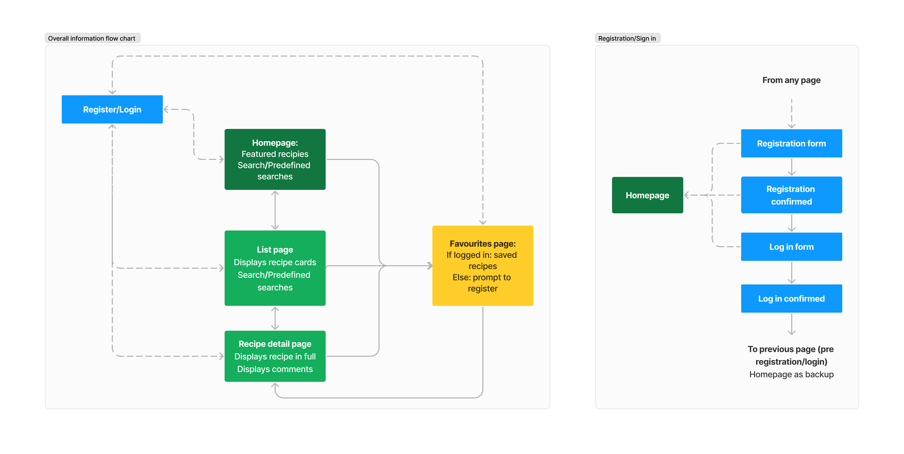
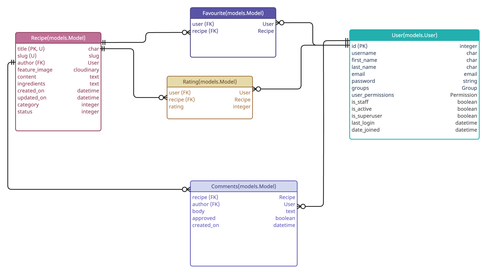
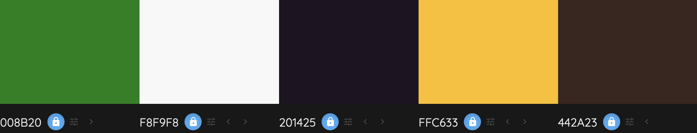
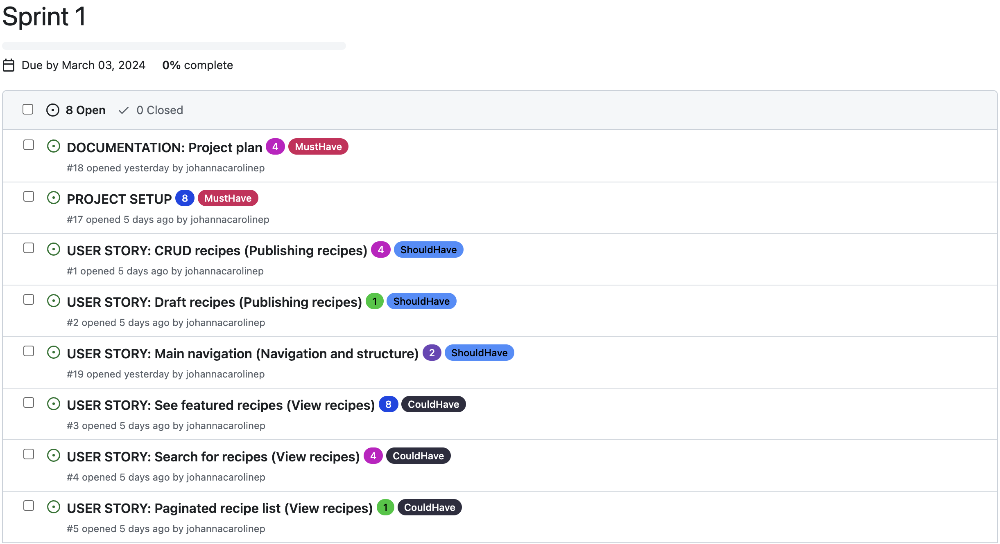
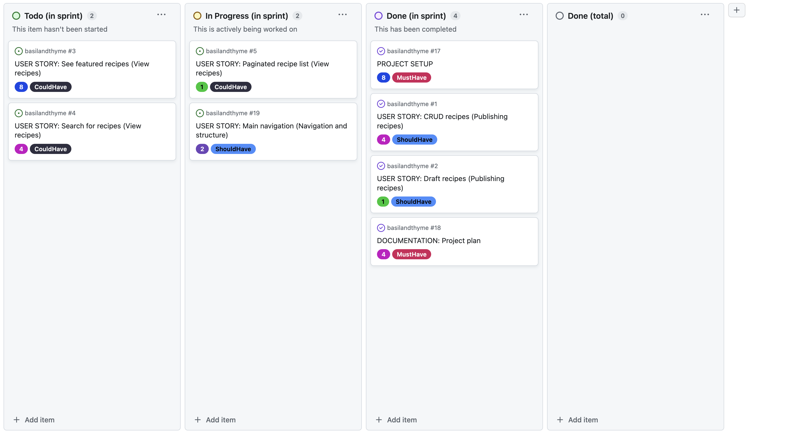
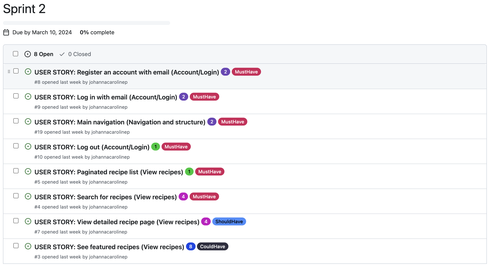
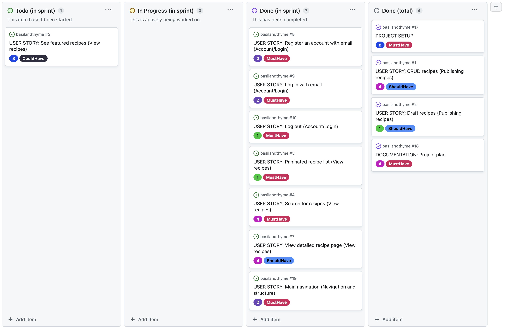
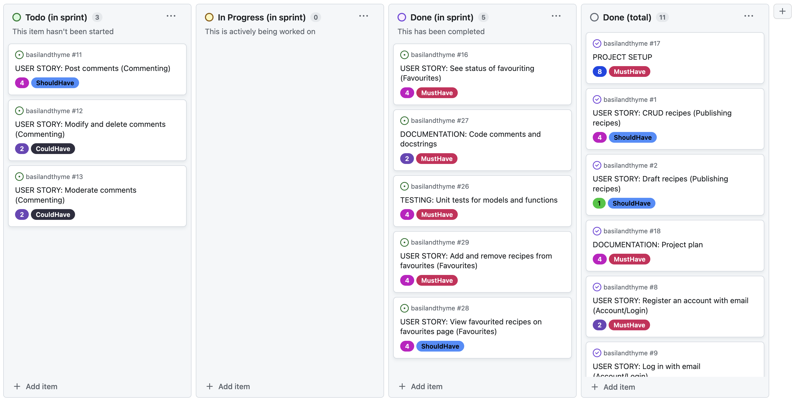

# Basil and Thyme

**Table of content**
- [Features](#features)
- [Planning and methodology](#planning)
    - [Site goals and strategy](#strategy)
    - [User stories](#user-stories)
    - [Information Architecture](#ia)
        - [Wireframes showing CRUD functionality and Dynamic content](#dynamic-crud)
    - [Database ERD](#erd)
    - [Surface plane Design](#surface-plane-design)
        - [Colours](#colours)
        - [Fonts](#fonts)
        - [Logo](#logo)
        - [Design wireframes](#design-wireframes)
    - [Agile methodology](#agile-methodology)
- [Tools and technologies](#tools-and-technologies)
- [Testing](#testing)
- [Bugs](#bugs)
- [Credits](#credits)
- [Acknowledgements](#acknowledgements)

---

<a id="features"></a>
## Features


<a id="planning"></a>
## Planning and methodology

<a id="strategy"></a>
### Site goals and strategy

The fictive company *Basil & Thyme* wants to build a large user base for their recipe website, by providing a delightful, useful, and engaging experience for their users.

Building a large user base opens up future monetization opportunities, in the form of e.g. ad placements and/or partnerships with brands in the industry looking to promote their products. Basil & Thyme could charge for recommending the use of specific brands in their recipes, or for releasing editorial content on the site in partnership with these brands.

*Basil & Thyme's* strategy for building their user base, in their audience of home chefs, relies on building a website that is appealing to this audience, and engaging enough to make users want to come back for more.

It is important to the strategy that interacting with the website and consuming content on the site elicits a positive response from users. Beyond providing high-quality content appealing to the audience, this should be done by paying attention to information architecture, interaction design, and surface-level design, to achieve an intuitive and positive user experience.

In order to make the website more engaging, CRUD functionality should be included already at an early stage, in scope for the initial release, in the form of ratings, commenting and wishlisting. 

Another important aspect of creating their user base is to be able to continually add and update content to the site, giving users new and fresh content in order to promote user retention. Therefore superusers of the site must be able to easily post new recipes.

To avoid negative experiences that could severely damage user retention, the website must be built to a high standard. Comprehensive testing should be used to minimise the risk of changes breaking the website when pushed to production.


<a id="user-stories"></a>
### User stories


<a id="ia"></a>
### Information Architecture

The diagram displays the intended consumption of information on the website, and how a typical user may navigate through the site.




<a id="dynamic-crud"></a>
#### Wireframes showing CRUD functionality and Dynamic content

Below is a PDF with wireframes mapping dynamic content and CRUD functionality on the website.

[Wireframes with CRUD and dynamic content](documentation/wireframes-crud-dynamic.pdf)

As shown in the wireframes, the CRUD functionality on the website can be summarised as follows:

- Commenting: 
    - A signed-in user can post comments on a recipe.
    - The user can edit and delete their own comments.
    - A superuser can review comments and change the default status (approved) to *disapproved*.

<br/>

- Favouriting: 
    - A signed-in user can add a recipe to their *favourites* as well as remove recipes from their *favourites*.
    - If a user who is not signed in attempts to add a recipe to favourites, they are not allowed to do so, and instead gets prompted to either sign up or sign in.

<br/>

- Rating:
    - A signed-in user can give a recipe a rating, as well as remove their rating.
    - If a user who is not signed in attempts to give a rating they will not be allowed to do so, and instead gets prompted to either sign up or sign in.

<br/>

- Publishing recipes:
    - A signed-in super user can draft, publish, unpublish, edit and delete recipes on the Django admin panel (not showing in wireframes). 


<a id="erd"></a>
### Database ERD



<a id="surface-plane-design"></a>
### Surface plane Design

The overall look and feel of the website should be bright and clean.

<a id="colours"></a>
#### Colours



The green colour, #008B20, was chosen as the main brand colour, while yellow, #FFC633, and a dark brown, #442A23, were used as accents. These colours were chosen to represent natural colours that can be found in foods and ingredients.

A light grey colour, #FBF9F8, was chosen to provide a calm and clean background for white cards, or as a colour for cards on a white background. Since the cards would contain often colourful images as well as text elements, it was fitting to avoid an overly noisy impression, as well as to provide good colour contrast between text and background.

Lastly, a dark, almost black colour, #201425, was used for titles, to provide a softer impression (compared to pure black). 

In addition to these colours white and black were used, mainly for text elements.


<a id="fonts"></a>
#### Fonts

To support the bright and clean look of the website, the font Poppins was chosen for high legibility and a clean modern look.

Note: A second font may be selected at a later stage for headings.


<a id="logo"></a>
#### Logo

A simple logo was created for the project, consisting of the company name complemented by a symbol portraying kitchen utensils. In order to create some additional visual interest a different font was used for the “&” in the brand name.


<a id="design-wireframes"></a>
#### Design wireframes

- [Design wireframes Desktop](documentation/wireframes-design-desktop.pdf)
- [Design wireframes Tablet](documentation/wireframes-design-tablet.pdf)
- [Design wireframes Mobile](documentation/wireframes-design-mobile.pdf)


<a id="agile-methodology"></a>
### Agile methodology

#### Sprint 1



##### Sprint 1 wrap-up

Project board at the end of sprint 1:


Points completed in Sprint 1: 17

Velocity: 17

**Reflections:**
- I realised I need to be more careful when selecting items from the backlog to include in my sprints and to make sure I'm not including items that are dependent on other work having been completed beforehand. E.g the user story included for sprint 1 about the main navigation has acceptance criteria that mention how the navigation should change for logged-in/logged-out users. I would need to have completed basic registration and log-in functionality first in order to be able to complete it.

**Actions:**
- Rewrites: To enable faster progress on the project, I decided to rewrite some of my existing user stories. In short, stories relating to registering and signing in with email were split into smaller, more succinct stories.

- Additional items added to the backlog:
    - USER STORY: Custom 404 page (Navigation and structure): As a **Site User** I can **see an informative 404 page guiding me back to the main page if I visit a page that does not exist by mistake** so that I can **easily get back to the home page with minimal disruption**.

#### Sprint 2


##### Sprint 2 wrap-up

Project board at end of sprint 2:


Points completed in Sprint 2: 16

Velocity: 16.5

**Reflections:**
- In the early stages of the project, I have not prioritised adding docstrings and testing, instead focusing on getting a working base project set up. As the project has progressed, and features have been added in, I see a need at this point to implement testing and to add docstrings to all classes, methods and functions. Going forward docstrings and testing should be done continuously. 

**Actions:**
- Rewrite 1 existing story into more succinct stories: 
    - **Original:** USER STORY: Save recipes (Saving): As a Logged in User I can save a recipe so that I can easily find the recipe at a later stage.
    - **New:** USER STORY: View favourited recipes on favourites page (Favourites): As a **Logged in User** I can **see my favourite recipes on the favourites page** so that I can **easily access my favourite recipes when I need them**.
    - **New:** USER STORY: Add and remove recipes from favourites (Favourites): As a **Logged in User** I can **favourite and unfavourite recipes** so that I can **save or remove recipes from my favourites easily**.
    - **New:** USER STORY: Try to favourite a recipe as a non-logged in user (Favourites): As a **Non-Logged in User**, I can **get informed to sign up or log in when trying to favourite a recipe** so that I can **understand how to access the functionality**.
    - **New:** USER STORY: See status of favouriting (Favourites): As a **Logged in User** I can **see the status of favouriting (favourited or not) for all recipe cards and detail pages** so that I can **know which recipes I have favourited without visiting the favourites page**.


- Additional items added to the backlog:
    - TESTING: Unit tests for models and functions: Add unit tests for models and functions written up until this point to enhance code quality. Add unit tests as part of the pre-commit hook to prevent faulty code from being pushed to GitHub.
    - DOCUMENTATION: Code comments and docstrings: Add code comments and docstrings to any classes, methods and functions written so far to improve code readability and maintainability.
    - USER STORY: Sign up/log in with social (Account signup/login): As a **Site User** I can **register an account using an existing social media account** so that I can **have a faster and smoother registration and login experience**.
    - USER STORY: Email verification (Account/Login): As a **Site User signing up for an account** I can **verify my email** so that I can **feel more secure and trust that my account is protected**.

#### Sprint 3


##### Sprint 3 wrap-up

Project board at end of sprint 3:


Points completed: 18

Velocity: 17

**Actions**:
- Moved 3 User Stories back to the backlog
- Reprioritised backlog
- Re-evaluated points for some backlog items

#### Sprint 4


<a id="tools-and-technologies"></a>
## Tools and technologies

<a id="testing"></a>
## Testing

<a id="bugs"></a>
## Bugs

### Solved bugs

#### 2024-03-03: Missed adding CLOUDINARY_URL configuration variable in Heroku

While working on displaying an overview of a recipe in a card format (creating the recipes.html template), I got a 500 error on the deployed version of the site. The error occurred in the first deployment after adding a recipe with a user-uploaded image and code in the template to display recipe images.

##### Troubleshooting
I started by trying to get a better understanding of the scope of the problem. The homepage, which was set up to display a simple “Hello world” was still working correctly. The admin panel was displaying. However, when trying to add or change a recipe, I would get the 500 error, and on the /recipes page I would also get the 500 error.

I found the issue particularly difficult to troubleshoot since the project was working as intended on localhost on my machine, and the Heroku logs did not provide much explanation for the 500 error.

##### Steps taken:
First, I tried to comment out the if statements I had been working on leading up to the error and redeploying, but still got the same error.

Next, I tried making a migration of my recipe_book models since I had made a small adjustment to the choices used by the category field in my Recipe model. Once again, I redeployed the project but still got the same error.

At this point I started reflecting more deeply on that the project worked as intended in the local environment and the issue being isolated to the deployed version. This led me to double-check the configuration variables in Heroku. I then found I was missing the CLOUDINARY_URL variable.

##### Solution:
After correctly adding the CLOUDINARY_URL config variable, I was able to confirm the project worked as intended, on the deployed site as well as the local environment.

#### 2024-03-14: Missing file ending of test_models_favourite.py and Favourite uniqueness constraint not enforced

This bug was a combination of two factors:
1. While working on writing tests for the **Favourite model**, I realised the tests were not actually being run, and discovered I had misnamed my file to `test_models_favourite`, instead of `test_models_favourite.py`. This meant that the file was not recognized as a test file and was not run by Django unittest. Adding the ``.py`` file ending fixed this.

2. As the tests ran, I could see that one of the previously written tests in the file was failing. The issue concerned a test for the uniqueness constraint on the Favourite model, meant to ensure the same user can not favourite the same recipe twice: 

The uniqueness constraint in the Recipe model meta class:
``````python
class Meta:
        unique_together = ('user', 'recipe')
``````

The failing test:
``````python
def test_unique_favourite_constraint(self):
        """
        Test to make sure the same user can not favourite the same recipe twice
        """
        Favourite.objects.create(user=self.user, recipe=self.recipe)
        with self.assertRaises(IntegrityError):
            Favourite.objects.create(user=self.user, recipe=self.recipe)
``````
##### Steps taken:
1. By adding print statements, and creating more Favourite objects within the test method, I could confirm that the uniqueness constraint was not being enforced. I was able to create duplicate Favourite objects (same user and recipe), with no errors being raised.

2. Next, I confirmed that the uniqueness constraint **was** being enforced in the _Django admin panel_. As a _super user_, I could create Favourites but not duplicate ones.

3. Next, I had a closer look in the [Django documentation](https://docs.djangoproject.com/en/5.0/ref/models/options/) at how the `unique_together` key worked, which was used in the Meta class of the Favourite model. Reading the documentation brought to my attention that `unique_together` may be deprecated, and recommended the use of `UniqueConstraint` instead.

##### Solution:
After adding the recommended changes from the Django documentation and migrating, I re-ran the tests to confirm that the test was now raising an `IntegrityError` when attempting to create a duplicate Favourite, as expected.

New implementation of Meta class in Favourite model:
``````python
class Meta:
        constraints = [
            models.UniqueConstraint(fields=['user', 'recipe'], name='unique_favourite')
        ]
``````


<a id="credits"></a>
## Credits

- Adding extra context: https://docs.djangoproject.com/en/5.0/topics/class-based-views/generic-display/#adding-extra-context
- AssertRaises: https://docs.python.org/3/library/unittest.html#unittest.TestCase.assertRaises
- full_clean(): https://docs.djangoproject.com/en/5.0/ref/forms/validation/

<a id="acknowledgements"></a>
## Acknowledgements