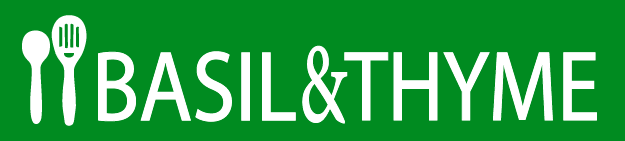

# Basil and Thyme

**Table of content**
- [Features](#features)
- [Planning and methodology](#planning)
    - [Site goals and strategy](#strategy)
    - [User stories](#user-stories)
    - [Information Architecture](#ia)
        - [Map of CRUD functionality](#map-of-crud)
    - [Database ERD](#erd)
    - [Surface plane Design](#surface-plane-design)
        - [Colours](#colours)
        - [Fonts](#fonts)
        - [Logo](#logo)
        - [Design wireframes](#design-wireframes)
        - [Agile methodology](#agile-methodology)
- [Tools and technologies](#tools-and-technologies)
- [Testing](#testing)
- [Bugs](#bugs)
- [Credits](#credits)
- [Acknowledgements](#acknowledgements)

---

## Features

## Planning and methodology

### Site goals and strategy

The fictive company *Basil & Thyme* wants to build a large user base for their recipe website, by providing a delightful, useful, and engaging experience for their users.

Building a large user base opens up future monetization opportunities, in the form of e.g. ad placements and/or partnerships with brands in the industry looking to promote their products. Basil & Thyme could charge for recommending the use of specific brands in their recipes, or for releasing editorial content on the site in partnership with these brands.

*Basil & Thyme's* strategy for building their user base, in their audience of home chefs, relies on building a website that is appealing to this audience, and engaging enough to make users want to come back for more.

It is important to the strategy that interacting with the website and consuming content on the site elicits a positive response from users. Beyond providing high-quality content appealing to the audience, this should be done by paying attention to information architecture, interaction design, and surface-level design, to achieve an intuitive and positive user experience.

In order to make the website more engaging, CRUD functionality should be included already at an early stage, in scope for the initial release, in the form of ratings, commenting and wishlisting. 

Another important aspect of creating their user base is to be able to continually add and update content to the site, giving users new and fresh content in order to promote user retention. Therefore superusers of the site must be able to easily post new recipes.

To avoid negative experiences that could severely damage user retention, the website must be built to a high standard. Comprehensive testing should be used to minimise the risk of changes breaking the website when pushed to production.

### User stories

### Information Architecture

The diagram displays the intended consumption of information on the website, and how a typical user may navigate through the site.

#### Map of CRUD functionality

### Database ERD

### Surface plane Design

The overall look and feel of the website should be bright and clean.

#### Colours

The green colour, #008B20, was chosen as the main brand colour, while yellow, #FFC633, and a dark brown, #442A23, were used as accents. These colours were chosen to represent natural colours that can be found in foods and ingredients.

A light grey colour, #FBF9F8, was chosen to provide a calm and clean background for white cards, or as a colour for cards on a white background. Since the cards would contain often colourful images as well as text elements, it was fitting to avoid an overly noisy impression, as well as to provide good colour contrast between text and background.

Lastly, a dark, almost black colour, #201425, was used for titles, to provide a softer impression (compared to pure black). 

In addition to these colours white and black were used, mainly for text elements.

#### Fonts

To support the bright and clean look of the website, the font Poppins was chosen for high legibility and a clean modern look.

Note: A second font may be selected at a later stage for headings.

#### Logo

A simple logo was created for the project, consisting of the company name complemented by a symbol portraying kitchen utensils. In order to create some additional visual interest a different font was used for the “&” in the brand name.

#### Design wireframes

### Agile methodology

## Tools and technologies

## Testing

## Bugs

## Credits

## Acknowledgements