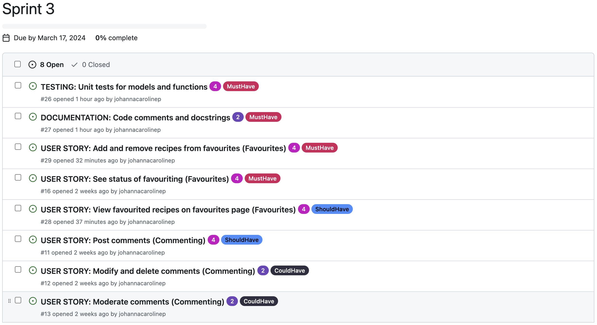
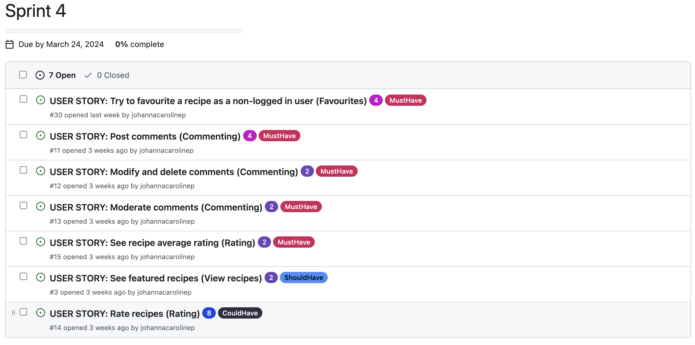

# Basil and Thyme

**Table of content**
- [Features](#features)
- [Planning and methodology](#planning)
    - [Site goals and strategy](#strategy)
    - [User stories](#user-stories)
    - [Information Architecture](#ia)
        - [Wireframes showing CRUD functionality and Dynamic content](#dynamic-crud)
    - [Database ERD](#erd)
    - [Surface plane Design](#surface-plane-design)
        - [Colours](#colours)
        - [Fonts](#fonts)
        - [Logo](#logo)
        - [Design wireframes](#design-wireframes)
    - [Agile methodology](#agile-methodology)
- [Tools and technologies](#tools-and-technologies)
- [Deployment](#deployment)
- [Testing](#testing)
- [Bugs](#bugs)
- [Credits](#credits)
- [Acknowledgements](#acknowledgements)

---

<a id="features"></a>
## Features


<a id="planning"></a>
## Planning and methodology

<a id="strategy"></a>
### Site goals and strategy

The fictive company *Basil & Thyme* wants to build a large user base for their recipe website, by providing a delightful, useful, and engaging experience for their users.

Building a large user base opens up future monetization opportunities, in the form of e.g. ad placements and/or partnerships with brands in the industry looking to promote their products. Basil & Thyme could charge for recommending the use of specific brands in their recipes, or for releasing editorial content on the site in partnership with these brands.

*Basil & Thyme's* strategy for building their user base, in their audience of home chefs, relies on building a website that is appealing to this audience, and engaging enough to make users want to come back for more.

It is important to the strategy that interacting with the website and consuming content on the site elicits a positive response from users. Beyond providing high-quality content appealing to the audience, this should be done by paying attention to information architecture, interaction design, and surface-level design, to achieve an intuitive and positive user experience.

In order to make the website more engaging, CRUD functionality should be included already at an early stage, in scope for the initial release, in the form of ratings, commenting and wishlisting. 

Another important aspect of creating their user base is to be able to continually add and update content to the site, giving users new and fresh content in order to promote user retention. Therefore superusers of the site must be able to easily post new recipes.

To avoid negative experiences that could severely damage user retention, the website must be built to a high standard. Comprehensive testing should be used to minimise the risk of changes breaking the website when pushed to production.


<a id="user-stories"></a>
### User stories


<a id="ia"></a>
### Information Architecture

The diagram displays the intended consumption of information on the website, and how a typical user may navigate through the site.


<a id="dynamic-crud"></a>
#### Wireframes showing CRUD functionality and Dynamic content

Below is a PDF with wireframes mapping dynamic content and CRUD functionality on the website.

[Wireframes with CRUD and dynamic content](documentation/wireframes-crud-dynamic.pdf)

As shown in the wireframes, the CRUD functionality on the website can be summarised as follows:

- Commenting: 
    - A signed-in user can post comments on a recipe.
    - The user can edit and delete their own comments.
    - A superuser can review comments and change the default status (approved) to *disapproved*.

<br/>

- Favouriting: 
    - A signed-in user can add a recipe to their *favourites* as well as remove recipes from their *favourites*.
    - If a user who is not signed in attempts to add a recipe to favourites, they are not allowed to do so, and instead gets prompted to either sign up or sign in.

<br/>

- Rating:
    - A signed-in user can give a recipe a rating, as well as remove their rating.
    - If a user who is not signed in attempts to give a rating they will not be allowed to do so, and instead gets prompted to either sign up or sign in.

<br/>

- Publishing recipes:
    - A signed-in super user can draft, publish, unpublish, edit and delete recipes on the Django admin panel (not showing in wireframes). 


<a id="erd"></a>
### Database ERD


<a id="surface-plane-design"></a>
### Surface plane Design

The overall look and feel of the website should be bright and clean.

<a id="colours"></a>
#### Colours


The green colour, #008B20, was chosen as the main brand colour, while yellow, #FFC633, and a dark brown, #442A23, were used as accents. These colours were chosen to represent natural colours that can be found in foods and ingredients.

A light grey colour, #FBF9F8, was chosen to provide a calm and clean background for white cards, or as a colour for cards on a white background. Since the cards would contain often colourful images as well as text elements, it was fitting to avoid an overly noisy impression, as well as to provide good colour contrast between text and background.

Lastly, a dark, almost black colour, #201425, was used for titles, to provide a softer impression (compared to pure black). 

In addition to these colours white and black were used, mainly for text elements.


<a id="fonts"></a>
#### Fonts

To support the bright and clean look of the website, the font Poppins was chosen for high legibility and a clean modern look.

Note: A second font may be selected at a later stage for headings.


<a id="logo"></a>
#### Logo

A simple logo was created for the project, consisting of the company name complemented by a symbol portraying kitchen utensils. In order to create some additional visual interest a different font was used for the “&” in the brand name.


<a id="design-wireframes"></a>
#### Design wireframes

- [Design wireframes Desktop](documentation/wireframes-design-desktop.pdf)
- [Design wireframes Tablet](documentation/wireframes-design-tablet.pdf)
- [Design wireframes Mobile](documentation/wireframes-design-mobile.pdf)


<a id="agile-methodology"></a>
### Agile methodology

#### Sprint 1


##### Sprint 1 wrap-up

Project board at the end of sprint 1:


Points completed in Sprint 1: 17

Velocity: 17

**Reflections:**
- I realised I need to be more careful when selecting items from the backlog to include in my sprints and to make sure I'm not including items that are dependent on other work having been completed beforehand. E.g the user story included for sprint 1 about the main navigation has acceptance criteria that mention how the navigation should change for logged-in/logged-out users. I would need to have completed basic registration and log-in functionality first in order to be able to complete it.

**Actions:**
- Rewrites: To enable faster progress on the project, I decided to rewrite some of my existing user stories. In short, stories relating to registering and signing in with email were split into smaller, more succinct stories.

- Additional items added to the backlog:
    - USER STORY: Custom 404 page (Navigation and structure): As a **Site User** I can **see an informative 404 page guiding me back to the main page if I visit a page that does not exist by mistake** so that I can **easily get back to the home page with minimal disruption**.

#### Sprint 2


##### Sprint 2 wrap-up

Project board at end of sprint 2:


Points completed in Sprint 2: 16

Velocity: 16.5

**Reflections:**
- In the early stages of the project, I have not prioritised adding docstrings and testing, instead focusing on getting a working base project set up. As the project has progressed, and features have been added in, I see a need at this point to implement testing and to add docstrings to all classes, methods and functions. Going forward docstrings and testing should be done continuously. 

**Actions:**
- Rewrite 1 existing story into more succinct stories: 
    - **Original:** USER STORY: Save recipes (Saving): As a Logged in User I can save a recipe so that I can easily find the recipe at a later stage.
    - **New:** USER STORY: View favourited recipes on favourites page (Favourites): As a **Logged in User** I can **see my favourite recipes on the favourites page** so that I can **easily access my favourite recipes when I need them**.
    - **New:** USER STORY: Add and remove recipes from favourites (Favourites): As a **Logged in User** I can **favourite and unfavourite recipes** so that I can **save or remove recipes from my favourites easily**.
    - **New:** USER STORY: Try to favourite a recipe as a non-logged in user (Favourites): As a **Non-Logged in User**, I can **get informed to sign up or log in when trying to favourite a recipe** so that I can **understand how to access the functionality**.
    - **New:** USER STORY: See status of favouriting (Favourites): As a **Logged in User** I can **see the status of favouriting (favourited or not) for all recipe cards and detail pages** so that I can **know which recipes I have favourited without visiting the favourites page**.


- Additional items added to the backlog:
    - TESTING: Unit tests for models and functions: Add unit tests for models and functions written up until this point to enhance code quality. Add unit tests as part of the pre-commit hook to prevent faulty code from being pushed to GitHub.
    - DOCUMENTATION: Code comments and docstrings: Add code comments and docstrings to any classes, methods and functions written so far to improve code readability and maintainability.
    - USER STORY: Sign up/log in with social (Account signup/login): As a **Site User** I can **register an account using an existing social media account** so that I can **have a faster and smoother registration and login experience**.
    - USER STORY: Email verification (Account/Login): As a **Site User signing up for an account** I can **verify my email** so that I can **feel more secure and trust that my account is protected**.

#### Sprint 3


##### Sprint 3 wrap-up

Project board at end of sprint 3:


Points completed: 18

Velocity: 17

**Actions**:
- Moved 3 User Stories back to the backlog
- Reprioritised backlog
- Re-evaluated points for some backlog items

#### Sprint 4



##### Sprint 4 wrap-up

Project board at end of sprint 4:


Points completed: 14

Velocity: 16.25

**Actions**:
- Moved 2 User Stories back to the backlog
- Reprioritised backlog
- Added 2 new User Stories to the backlog:
    - USER STORY: Experience on screen readers (ACCESSIBILITY): As a **Site User utilizing a screen reader** I can **listen to descriptive text representing any visual element on the website** so that I can **be included, navigate on the website, access the content, and use all core functionality**.
    - USER STORY: Experience for keyboard users (ACCESSIBILITY): As a **Site User not able to utilize a mouse** I can **focus on and access all interactive elements on the website using a keyboard** so that I can **be included, navigate on the website, access the content, and use all core functionality**.
- Added additional backlog items related to TESTING.

#### Sprint 5:


##### Sprint 5 wrap-up:

Project board at end of sprint 5:


Points completed in sprint: 21

Velocity: 17.2

**Reflections:**
As can be seen in the screenshot of the project board, a user story marked as "MustHave" remained in the "To do" part of the board at the end of the sprint: USER STORY: Email verification (Account/Login).

I have been researching for the last few weeks the possibility of adding email verification as well as social sign-in functionality to the project, since I believe this would greatly improve the overall user experience. However, after speaking to my mentor, as well as researching other students' experience with adding such functionality in the Code Institute slack community, I have decided to treat these features as future improvements instead, putting them outside the scope of this project.

I was alerted that these features would introduce a risk, since e.g. unexpected policy changes could require adjustments to the code for the features to continue working as expected, while I would not be allowed to make these changes after project submission.

Furthermore, on closer reflection, I believe the implementation of this functionality to be mainly configuration-based, rather than code-based. For this reason, also, I thought it would be more suitable to focus on features that would better present my coding abilities, invest time in flushing out existing features and refactoring my code.

**Actions:**
- Moved two user stories back to the backlog.
- 3 new user stories were added to the backlog:
    - USER STORY: Using the admin view - As a **Super user** I can **rely on the field validation, as well as see clear instructions in the admin view** so that I can **trust in that the content I am publishing will be valid**.
    - USER STORY: Consistent styling - As a **Site User** I can **observe consistent styling, structure and interaction design across all pages on the website** so that I can **have a pleasant experience with the website**.
    - USER STORY: Page title and meta tags - As a **Site User finding the website through a search engine** I can **read a descriptive search result** so that I can **understand if the result is relevant to me**.
- Additional items relating to testing and code refactoring were added to the backlog.

#### Sprint 6


##### Sprint 6 wrap-up

OBS! Sprint 6 should have been closed 2 days prior. The delay was due to being out traveling and not having access to my computer.

Project board at end of sprint 6:


Points finished: 14

Velocity: 16.66

**Actions taken:**
- Added PBI's relating to remaining project documentation to the backlog.

#### Sprint 7


<a id="tools-and-technologies"></a>
## Tools and technologies

### Languages:

- [Python 3.12.1](https://www.python.org/downloads/release/python-385/) - Used to write the application's server-side logic.
- [JavaScript](https://www.javascript.com/) - Was used to develop interactive components on the website.
- [HTML5](https://developer.mozilla.org/en-US/docs/Web/HTML) - Was used for the structure of the web pages.
- [CSS](https://developer.mozilla.org/en-US/docs/Web/css) - Was used to style the website.

### Frameworks:
- [Django 4.2.10](https://www.djangoproject.com/) - Python-based framework used to build the website.
- [Bootstrap 5](https://getbootstrap.com/) - CSS framework used to style the website.

### Databases:
- [PostgreSQL from Code Institute](https://dbs.ci-dbs.net/) - The database used to store the website's model data.

### Cloud:
- [Cloudinary](https://cloudinary.com/) - Was used for cloud-based image storage and management.
- [Heroku.com](https://id.heroku.com/login) - Was used to deploy the project.
- [GitHub](https://github.com/) - Was used to host the code of the website.

### Testing and validation
- [CI Python Linter](https://pep8ci.herokuapp.com/) - Was used to ensure the code adheres to PEP 8 standards
- [Chrome DevTools](https://developer.chrome.com/docs/devtools/open/) - Was used for debugging
- [LightHouse](https://chromewebstore.google.com/detail/lighthouse/blipmdconlkpinefehnmjammfjpmpbjk?hl=sv&pli=1) - Was used to test and optimize website performance, best practices and accessibility
- [JSHint](https://jshint.com/) - Was used to lint JavaScript code.
- [W3C Markup Validation Service](https://validator.w3.org/) - Was used to validate HTML.
- [W3C CSS Validation Service](https://jigsaw.w3.org/css-validator/) - Was used to validate CSS.

### Design
- [Neumorphism.io](https://neumorphism.io/#ffffff) - Was used to generate box-shadows for CSS.
- [Creately](https://app.creately.com/d/start/dashboard) - Was used to create the ERD diagram.
- [FontAwesome](https://fontawesome.com/) - Was used to create icons for the website.
- [Favicon generator](https://favicon.io/favicon-generator/) - Was used to create the website's favicon.
- [Adobe Illustrator](https://www.adobe.com/se/products/illustrator) - Was used to create the website logo and custom graphics.
- [Colormind](http://colormind.io/) - Was used to generate the colour scheme for the website.
- [Figma](https://www.figma.com/) - Was used to create wireframes and the information architecture diagram.

### Other:
- [Summernote](https://summernote.org/) - Was used as a text editor for the Django admin panel.
- [gunicorn](https://gunicorn.org/) - Was used as the webserver to run the website.
- [psycopg2](https://www.psycopg.org/) - Was used as the database adapter.
- [pre-commit](https://pre-commit.com/) - Was used to ensure code was not pushed to GitHub that would not pass existing tests, or in DEBUG mode.
- [VSCode](https://code.visualstudio.com/) - Was used as the IDE.
- [Git](https://git-scm.com/) - Was used for version control.


<a id="deployment"></a>
## Deployment

The program was deployed to [Heroku](https://id.heroku.com/login) and can be accessed by this [link](https://basil-and-thyme-e544c9b02aa3.herokuapp.com/).

### To run the application locally:

*Note:*
1. This project requires you to have Python 3 installed on your computer.

2. In order to run the project you will need to install and run [virtualenv](https://packaging.python.org/en/latest/guides/installing-using-pip-and-virtual-environments/). This is due to compatibility issues between some versions of Python, such as 3.9.6 and the version of Python run on Heroku.

Create a local copy of the GitHub repository by following one of the two processes below:

- Download ZIP file:
  1. Go to the [GitHub Repository](https://github.com/johannacarolinep/basilandthyme).
  2. Download the ZIP file containing the project.
  3. Extract the ZIP file to a location on your computer.

- Clone the repository:
  1. Run the following command in a terminal
  - `git clone git@github.com:johannacarolinep/basilandthyme.git`

#### Create a SECRET_KEY
You will need to create a SECRET_KEY since Django requires this for cryptographic signing.

1. In the top-level directory of your project, create an *env.py* file.
2. Add *env.py* to *.gitignore*.
3. In *env.py* add *import os* at the top of the file.
4. Still in *env.py*, add the following line of code:
```python
os.environ.setdefault(
    "SECRET_KEY", "<your secret key>"
)
```
5. You can use an online key generator for your secret key value, such as [RandomKeygen](https://randomkeygen.com/)

#### Create and connect a PostgreSQL database to the project
To run the project, you will need to create and connect a PostgreSQL database instance. I used the [tool provided by Code Institute](https://dbs.ci-dbs.net/) for this, which is available to current Code Institute students.

<details>
<summary>Click to open the instructions</summary>

1. Go to [https://dbs.ci-dbs.net/](https://dbs.ci-dbs.net/).
2. Follow the on-screen instructions to create a database.
3. You should now have received an email containing the URL for your database.
4. In the *env.py* file of your project, add the following line of code:
```python
os.environ.setdefault(
    "DATABASE_URL", "<the URL for your database>"
)
```

</details>

#### Connect a Cloudinary account to the project
[Cloudinary](https://cloudinary.com/), a cloud media platform, is used to store and serve images in the project.

<details>
<summary>Click to open the instructions</summary>

1. If you do not already have a Cloudinary account, you can create a free account [here](https://cloudinary.com/users/register_free).
2. Sign in to your Cloudinary account.
3. Once logged in, go to the tab "Programmable media", in the menu on the left-hand side, and then click "Dashboard". You should now see your "Product Environment Credentials".

4. In the *env.py* file of your project, add the following lines of code (with the correct values):
```python
os.environ.setdefault(
    "CLOUDINARY_URL", "<paste in value from the Cloudinary Dashboard>"
)
os.environ.setdefault("CLOUD_NAME", "<paste in value from the Cloudinary Dashboard>")
```

</details>

<br>

Install the dependencies listed in *requirements.txt*. 

  - While in the project directory, run the following command in the terminal:

```
pip install -r requirements.txt
```

#### Run migrations
After completing the preceding steps, you should be able to migrate the models of the project to your database. 

In the terminal, run the following command:
```
python3 manage.py makemigrations recipe_book
```

Followed by:
```
python3 manage.py migrate recipe_book
```

#### Run the project locally
You should now be able to run the app locally by running the following command in the terminal:
```
python3 manage.py runserver
```

#### Create a superuser
Some functionality in the project, such as creating new recipes, is limited to superusers. Therefore, in order to access the admin panel, you will need to create a superuser.

Write the following command in the terminal:
```
python3 manage.py createsuperuser
```
Follow the instructions in the terminal, which will prompt you for an email and password.

### Run the project as a remote web application by deploying to Heroku:

<details>
<summary>Click to open the instructions</summary>

- Clone the repository:
  1. Create your own GitHub repository to host the code. You will need to host this code on your repository for the following to work.

  2. Run the command `git remote set-url origin <Your GitHub Repo Path>` to set the remote repository location to your repository.

  3. Ensure that the `DEBUG` constant is set to `True` in the *settings.py* file of the project.

  4. Push the files to your repository with the following command:
  `git push`
  
  5. Create a Heroku account if you don't already have one here [Heroku](https://dashboard.heroku.com).

  6. Create a new Heroku application on the [Heroku Apps page](https://dashboard.heroku.com/apps), by clicking "New" in the upper right corner, and selecting "Create new app":

    

  7. Name the app, choose a region, and click "Create app".
    

  8. Go to the Deploy tab:
    

  9. In the "Deployment method" section, click on "GitHub - Connect to GitHub". Search for your repository and connect your application.
    

  10. Next, go to the Settings tab:
  

  11. Next, in the "Config Vars" section, click "Reveal Config Vars". You will need to add 4 Config Vars
  

- Config Var number 1:
    - **Key:** CLOUD_NAME **Value:** Copy the value of the CLOUD_NAME constant in your *env.py* file and paste it here (the value can also be found in your Cloudinary account).

- Config Var number 2:
    - **Key:** CLOUDINARY_URL **Value:** Copy the value of the CLOUDINARY_URL constant in your *env.py* file and paste it here (Alternatively the value can be found by logging in to your Cloudinary account).

- Config Var number 3:
    - **Key:** DATABASE_URL **Value:** Copy the value of the DATABASE_URL constant in your *env.py* file and paste it here. 

- Config Var number 4:
    - **Key:** SECRET_KEY **Value:** You can use an online secret key generator to create a value for this config var. It's good practice not to use the same value as the SECRET_KEY constant in your *env.py* file.

    

  12. After adding the 4 Config Vars, go back to the Deploy tab:

      

  13. In the "Manual deploy" section, click "Deploy Branch":

      

      - Wait for the completion of the deployment.

      

  14. You can now click the "View" button (in the screenshot above), to launch the application.

</details>


<a id="testing"></a>
## Testing

<a id="bugs"></a>
## Bugs

### Solved bugs

#### 2024-03-30: Incorrect value annotated to objects in RecipeListView

The rating value, represented by stars, on the recipe card (e.g. on the "Recipes page"), represents the recipe's average rating value (the average of all ratings the recipe has received). 

Clicking on the rating stars, the user is presented with a modal. In this modal, if the specific user has previously rated the recipe, their existing rating of that recipe should be displayed.

To achieve this, I annotated the query set in the RecipeListView with `avg_rating` and `user_rating`. While manually testing the functionality, I realised however that the user specific rating value was not always correct. 

Steps taken:
- Reviewing the code and data flow, adding in print statements for debugging, I came to realise that the value I was annotating to the objects to represent the `user_rating` was incorrect, and that I was actually annotating the recipe's average rating a second time instead.

```python
if user.is_authenticated:
           base_queryset = base_queryset.annotate(
               user_rating=models.F('rating_recipe__rating')
               )
```
- This caused a lot of issues in the UI. For example, when logging in as a separate user, who had not rated a recipe, upon clicking on the ratings display, the modal would open and state that I had given a rating to the recipe. 

- Since there would be instances where no rating existed for a given user and recipe, I knew I would need to use some type of condition for the annotation. Reading through the official Django documentation, I found that I could [use Case() expressions](https://docs.djangoproject.com/en/5.0/ref/models/conditional-expressions/#case) for this. 

- Reviewing the documentation and the examples provided. I was able to rewrite my code as per below:

```python
if user.is_authenticated:
           base_queryset = base_queryset.annotate(
               user_rating=models.Case(
                   models.When(rating_recipe__user=user, then=models.F('rating_recipe__rating')),
                   default=None,
                   output_field=models.IntegerField()
               )
               )
```

 - Lastly, I confirmed with print statements and by manually testing the UI that the values returned were now correct, matching the expected values for `user_rating`.

 #### 2024-03-27 Cloudinary images sent with HTTP
 On the deployed site, warnings were raised in the console, saying the images fetched from Cloudinary were being served with HTTP, and automatically upgraded to HTTPS. I wanted Django to fetch them through HTTPS by default. 

 Steps taken:
 - Researching the issue in the Cloudinary documentation I saw there was an option to configure a `secure` parameter to `true` to ensure that URLs would be generated as HTTPS. The documentation stated that the configuration parameters should be set globally, before importing the `cloudinary.uploader` and `cloudinary.api` classes.

From [Cloudinary documentation](https://cloudinary.com/documentation/django_integration#setting_configuration_parameters_globally):
```python
import cloudinary

cloudinary.config(
cloud_name = "xxxx",
api_key = "xxxxxxxxxxxx",
api_secret = "xxxxxxxxxxx",
api_proxy = "http://proxy.server:9999"
)

import cloudinary.uploader
import cloudinary.api
```

- Trying this approach, the issue with the HTTP URLs was solved. However, it instead gave an issue with the linter, for having imports not at the top of the file. 

- At this point, since the only parameter I was interested in was the `secure` parameter, I started removing parameters, removing the need for imports below the configuration parameters. It worked out, keeping only the `secure` and `cloud_name` parameters (which had to be included).

From settings.py:
```python
cloudinary.config(
    cloud_name=os.environ.get("CLOUD_NAME"),
    secure=True
)
```

- Finally, I confirmed the images were being served with HTTPS, and the linter not raising any error.

#### 2024-03-03: Missed adding CLOUDINARY_URL configuration variable in Heroku

While working on displaying an overview of a recipe in a card format (creating the recipes.html template), I got a 500 error on the deployed version of the site. The error occurred in the first deployment after adding a recipe with a user-uploaded image and code in the template to display recipe images.

##### Troubleshooting
I started by trying to get a better understanding of the scope of the problem. The homepage, which was set up to display a simple “Hello world” was still working correctly. The admin panel was displaying. However, when trying to add or change a recipe, I would get the 500 error, and on the /recipes page I would also get the 500 error.

I found the issue particularly difficult to troubleshoot since the project was working as intended on localhost on my machine, and the Heroku logs did not provide much explanation for the 500 error.

##### Steps taken:
First, I tried to comment out the if statements I had been working on leading up to the error and redeploying, but still got the same error.

Next, I tried making a migration of my recipe_book models since I had made a small adjustment to the choices used by the category field in my Recipe model. Once again, I redeployed the project but still got the same error.

At this point I started reflecting more deeply on that the project worked as intended in the local environment and the issue being isolated to the deployed version. This led me to double-check the configuration variables in Heroku. I then found I was missing the CLOUDINARY_URL variable.

##### Solution:
After correctly adding the CLOUDINARY_URL config variable, I was able to confirm the project worked as intended, on the deployed site as well as the local environment.

#### 2024-03-14: Missing file ending of test_models_favourite.py and Favourite uniqueness constraint not enforced

This bug was a combination of two factors:
1. While working on writing tests for the **Favourite model**, I realised the tests were not actually being run, and discovered I had misnamed my file to `test_models_favourite`, instead of `test_models_favourite.py`. This meant that the file was not recognized as a test file and was not run by Django unittest. Adding the ``.py`` file ending fixed this.

2. As the tests ran, I could see that one of the previously written tests in the file was failing. The issue concerned a test for the uniqueness constraint on the Favourite model, meant to ensure the same user can not favourite the same recipe twice: 

The uniqueness constraint in the Recipe model meta class:
``````python
class Meta:
        unique_together = ('user', 'recipe')
``````

The failing test:
``````python
def test_unique_favourite_constraint(self):
        """
        Test to make sure the same user can not favourite the same recipe twice
        """
        Favourite.objects.create(user=self.user, recipe=self.recipe)
        with self.assertRaises(IntegrityError):
            Favourite.objects.create(user=self.user, recipe=self.recipe)
``````
##### Steps taken:
1. By adding print statements, and creating more Favourite objects within the test method, I could confirm that the uniqueness constraint was not being enforced. I was able to create duplicate Favourite objects (same user and recipe), with no errors being raised.

2. Next, I confirmed that the uniqueness constraint **was** being enforced in the _Django admin panel_. As a _super user_, I could create Favourites but not duplicate ones.

3. Next, I had a closer look in the [Django documentation](https://docs.djangoproject.com/en/5.0/ref/models/options/) at how the `unique_together` key worked, which was used in the Meta class of the Favourite model. Reading the documentation brought to my attention that `unique_together` may be deprecated, and recommended the use of `UniqueConstraint` instead.

##### Solution:
After adding the recommended changes from the Django documentation and migrating, I re-ran the tests to confirm that the test was now raising an `IntegrityError` when attempting to create a duplicate Favourite, as expected.

New implementation of Meta class in Favourite model:
``````python
class Meta:
        constraints = [
            models.UniqueConstraint(fields=['user', 'recipe'], name='unique_favourite')
        ]
``````


<a id="credits"></a>
## Credits

- Adding extra context: https://docs.djangoproject.com/en/5.0/topics/class-based-views/generic-display/#adding-extra-context
- AssertRaises: https://docs.python.org/3/library/unittest.html#unittest.TestCase.assertRaises
- full_clean(): https://docs.djangoproject.com/en/5.0/ref/forms/validation/
- date formatting: https://docs.djangoproject.com/en/5.0/ref/templates/builtins/#date

<a id="acknowledgements"></a>
## Acknowledgements