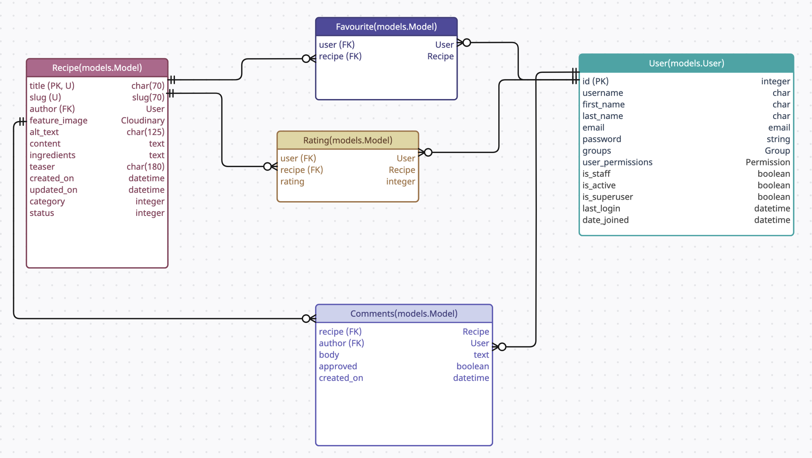
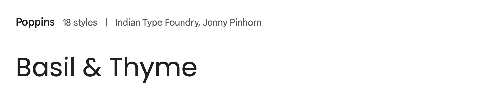
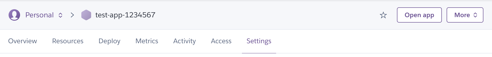

# Basil and Thyme

Basil and Thyme is a recipe website where users can search for and browse recipes. For signed in users, the website offers functionality such as favouriting recipes, rating recipes, and commenting.

The deployed website can be found [here](https://basil-and-thyme-e544c9b02aa3.herokuapp.com/).

---

**Table of content**

- [Planning and methodology](#planning)
    - [Site goals and strategy](#strategy)
    - [Information Architecture](#ia)
        - [Wireframes showing CRUD functionality and Dynamic content](#dynamic-crud)
    - [Database ERD](#erd)
    - [Surface plane Design](#surface-plane-design)
        - [Colours](#colours)
        - [Fonts](#fonts)
        - [Logo](#logo)
        - [Design wireframes](#design-wireframes)
    - [Agile methodology](#agile-methodology)
    - [User stories](#user-stories)
    - [Future improvements](#future-improvements)
- [Features](#features)
- [Tools and technologies](#tools-and-technologies)
- [Repository description](#repo-description)
- [Deployment](#deployment)
- [Testing](#testing)
- [Bugs](#bugs)
- [Credits](#credits)
- [Acknowledgements](#acknowledgements)

---


<a id="planning"></a>
## Planning and methodology

<a id="strategy"></a>
### Site goals and strategy

The fictive company *Basil & Thyme* wants to build a large user base for their recipe website, by providing a delightful, useful, and engaging experience for their users.

<details>
<summary>Click for details</summary>

Building a large user base opens up future monetization opportunities, in the form of e.g. ad placements and/or partnerships with brands in the industry looking to promote their products. Basil & Thyme could charge for recommending the use of specific brands in their recipes, or for releasing editorial content on the site in partnership with these brands.

*Basil & Thyme's* strategy for building their user base, in their audience of home chefs, relies on building a website that is appealing to this audience, and engaging enough to make users want to come back for more.

It is important to the strategy that interacting with the website and consuming content on the site elicits a positive response from users. Beyond providing high-quality content appealing to the audience, this should be done by paying attention to information architecture, interaction design, and surface-level design, to achieve an intuitive and positive user experience.

In order to make the website more engaging, CRUD functionality should be included already at an early stage, in scope for the initial release, in the form of ratings, commenting and wishlisting. 

Another important aspect of creating their user base is to be able to continually add and update content to the site, giving users new and fresh content in order to promote user retention. Therefore superusers of the site must be able to easily post new recipes.

To avoid negative experiences that could severely damage user retention, the website must be built to a high standard. Comprehensive testing should be used to minimise the risk of changes breaking the website when pushed to production.

</details>


<a id="ia"></a>
### Information Architecture

The diagram displays the intended consumption of information on the website, and how a typical user may navigate through the site.


<a id="dynamic-crud"></a>
#### Wireframes showing CRUD functionality and Dynamic content

Below is a PDF with wireframes mapping dynamic content and CRUD functionality on the website.

[Wireframes with CRUD and dynamic content](documentation/wireframes-crud-dynamic.pdf)

As shown in the wireframes, the CRUD functionality on the website can be summarised as follows:

- Commenting: 
    - A signed-in user can post comments on a recipe.
    - The user can edit and delete their own comments.
    - A superuser can review comments and change the default status (approved) to *disapproved*.

<br/>

- Favouriting: 
    - A signed-in user can add a recipe to their *favourites* as well as remove recipes from their *favourites*.
    - If a user who is not signed in attempts to add a recipe to favourites, they are not allowed to do so, and instead gets prompted to either sign up or sign in.

<br/>

- Rating:
    - A signed-in user can give a recipe a rating, as well as remove their rating.
    - If a user who is not signed in attempts to give a rating they will not be allowed to do so, and instead gets prompted to either sign up or sign in.

<br/>

- Publishing recipes:
    - A signed-in super user can draft, publish, unpublish, edit and delete recipes on the Django admin panel (not showing in wireframes). 


<a id="erd"></a>
### Database ERD



<a id="surface-plane-design"></a>
### Surface plane Design

The overall look and feel of the website should be bright and clean.

<a id="colours"></a>
#### Colours


The green colour, #008B20, was chosen as the main brand colour, while yellow, #FFC633, and a dark brown, #442A23, were used as accents. These colours were chosen to represent natural colours that can be found in foods and ingredients.

A light grey colour, #FBF9F8, was chosen to provide a calm and clean background for white cards, or as a colour for cards on a white background. Since the cards would contain often colourful images as well as text elements, it was fitting to avoid an overly noisy impression, as well as to provide good colour contrast between text and background.

Lastly, a dark, almost black colour, #201425, was used for titles, to provide a softer impression (compared to pure black). 

In addition to these colours white and black were used, mainly for text elements.


<a id="fonts"></a>
#### Fonts

To support the bright and clean look of the website, the font Poppins was chosen for high legibility and a clean modern look.

Note: A second font may be selected at a later stage for headings.




<a id="logo"></a>
#### Logo

A simple logo was created for the project, consisting of the company name complemented by a symbol portraying kitchen utensils. In order to create some additional visual interest a different font was used for the “&” in the brand name.


<a id="design-wireframes"></a>
#### Design wireframes

- [Design wireframes Desktop](documentation/wireframes-design-desktop.pdf)
- [Design wireframes Tablet](documentation/wireframes-design-tablet.pdf)
- [Design wireframes Mobile](documentation/wireframes-design-mobile.pdf)


<a id="agile-methodology"></a>
### Agile methodology

Agile methodologies were used to develop this project.

<details>
<summary>Click for description of agile methodology in the project</summary>

In the planning phase a set of user stories were defined in order to ensure the project focused on adding value to its users. The user stories represented small/bite sized features to be implemented, allowing for the work to stay focused.

The user stories were also split up into EPICS reflecting larger features or sets of features on the site.

All user stories, as well as PBI’s that fell outside of the user stories (such as project setup and documentation) were added to a backlog, and given a points score to estimate the relative work required for implementation. The backlog was maintained throughout the project, meaning regular prioritisation of the PBI’s.

The project was split into 7 sprints/iterations of one week each. Before each sprint, the PBI’s with the highest priority were added to the iteration, and prioritised according to MoSCoW method, with a maximum of 60% of points having a “Must Have” status for the iteration. The PBI’s added to the iteration were also added to a board, making it easier to keep track and focus only on the PBI’s in scope for the iteration. At the end of each iteration, any user story/PBI for which all acceptance criteria had been met was closed, and any user story that had not been completed was moved back to the backlog, before reprioritising and defining the next sprint.

In keeping with Agile philosophies, new user stories and PBI's were allowed to enter the backlog throughout the project. Time was set aside at the end of each sprint, to reflect on the need to add new stories/edit existing ones.

</details>

#### Sprint 1

<details>
<summary>Click to see details of sprint 1</summary>

Sprint 1 milestone:


##### Sprint 1 wrap-up

Project board at the end of sprint 1:


Points completed in Sprint 1: 17

Velocity: 17

**Reflections:**
- I realised I need to be more careful when selecting items from the backlog to include in my sprints and to make sure I'm not including items that are dependent on other work having been completed beforehand. E.g the user story included for sprint 1 about the main navigation has acceptance criteria that mention how the navigation should change for logged-in/logged-out users. I would need to have completed basic registration and log-in functionality first in order to be able to complete it.

**Actions:**
- Rewrites: To enable faster progress on the project, I decided to rewrite some of my existing user stories. In short, stories relating to registering and signing in with email were split into smaller, more succinct stories.

- Additional items added to the backlog:
    - USER STORY: Custom 404 page (Navigation and structure): As a **Site User** I can **see an informative 404 page guiding me back to the main page if I visit a page that does not exist by mistake** so that I can **easily get back to the home page with minimal disruption**.

</details>

#### Sprint 2

<details>
<summary>Click to see details of sprint 2</summary>

Sprint 2 milestone:


##### Sprint 2 wrap-up

Project board at end of sprint 2:


Points completed in Sprint 2: 16

Velocity: 16.5

**Reflections:**
- In the early stages of the project, I have not prioritised adding docstrings and testing, instead focusing on getting a working base project set up. As the project has progressed, and features have been added in, I see a need at this point to implement testing and to add docstrings to all classes, methods and functions. Going forward docstrings and testing should be done continuously. 

**Actions:**
- Rewrite 1 existing story into more succinct stories: 
    - **Original:** USER STORY: Save recipes (Saving): As a Logged in User I can save a recipe so that I can easily find the recipe at a later stage.
    - **New:** USER STORY: View favourited recipes on favourites page (Favourites): As a **Logged in User** I can **see my favourite recipes on the favourites page** so that I can **easily access my favourite recipes when I need them**.
    - **New:** USER STORY: Add and remove recipes from favourites (Favourites): As a **Logged in User** I can **favourite and unfavourite recipes** so that I can **save or remove recipes from my favourites easily**.
    - **New:** USER STORY: Try to favourite a recipe as a non-logged in user (Favourites): As a **Non-Logged in User**, I can **get informed to sign up or log in when trying to favourite a recipe** so that I can **understand how to access the functionality**.
    - **New:** USER STORY: See status of favouriting (Favourites): As a **Logged in User** I can **see the status of favouriting (favourited or not) for all recipe cards and detail pages** so that I can **know which recipes I have favourited without visiting the favourites page**.


- Additional items added to the backlog:
    - TESTING: Unit tests for models and functions: Add unit tests for models and functions written up until this point to enhance code quality. Add unit tests as part of the pre-commit hook to prevent faulty code from being pushed to GitHub.
    - DOCUMENTATION: Code comments and docstrings: Add code comments and docstrings to any classes, methods and functions written so far to improve code readability and maintainability.
    - USER STORY: Sign up/log in with social (Account signup/login): As a **Site User** I can **register an account using an existing social media account** so that I can **have a faster and smoother registration and login experience**.
    - USER STORY: Email verification (Account/Login): As a **Site User signing up for an account** I can **verify my email** so that I can **feel more secure and trust that my account is protected**.

</details>

#### Sprint 3

<details>
<summary>Click to see details of sprint 3</summary>

Sprint 3 milestone:


##### Sprint 3 wrap-up

Project board at end of sprint 3:


Points completed: 18

Velocity: 17

**Actions**:
- Moved 3 User Stories back to the backlog
- Reprioritised backlog
- Re-evaluated points for some backlog items

</details>

#### Sprint 4

<details>
<summary>Click to see details of sprint 4</summary>

Sprint 4 milestone:


##### Sprint 4 wrap-up

Project board at end of sprint 4:


Points completed: 14

Velocity: 16.25

**Actions**:
- Moved 2 User Stories back to the backlog
- Reprioritised backlog
- Added 2 new User Stories to the backlog:
    - USER STORY: Experience on screen readers (ACCESSIBILITY): As a **Site User utilizing a screen reader** I can **listen to descriptive text representing any visual element on the website** so that I can **be included, navigate on the website, access the content, and use all core functionality**.
    - USER STORY: Experience for keyboard users (ACCESSIBILITY): As a **Site User not able to utilize a mouse** I can **focus on and access all interactive elements on the website using a keyboard** so that I can **be included, navigate on the website, access the content, and use all core functionality**.
- Added additional backlog items related to TESTING.

</details>

#### Sprint 5:

<details>
<summary>Click to see details of sprint 5</summary>

Sprint 5 milestone:


##### Sprint 5 wrap-up:

Project board at end of sprint 5:


Points completed in sprint: 21

Velocity: 17.2

**Reflections:**
As can be seen in the screenshot of the project board, a user story marked as "MustHave" remained in the "To do" part of the board at the end of the sprint: USER STORY: Email verification (Account/Login).

I have been researching for the last few weeks the possibility of adding email verification as well as social sign-in functionality to the project, since I believe this would greatly improve the overall user experience. However, after speaking to my mentor, as well as researching other students' experience with adding such functionality in the Code Institute slack community, I have decided to treat these features as future improvements instead, putting them outside the scope of this project.

I was alerted that these features would introduce a risk, since e.g. unexpected policy changes could require adjustments to the code for the features to continue working as expected, while I would not be allowed to make these changes after project submission.

Furthermore, on closer reflection, I believe the implementation of this functionality to be mainly configuration-based, rather than code-based. For this reason, also, I thought it would be more suitable to focus on features that would better present my coding abilities, invest time in flushing out existing features and refactoring my code.

**Actions:**
- Moved two user stories back to the backlog.
- 3 new user stories were added to the backlog:
    - USER STORY: Using the admin view - As a **Super user** I can **rely on the field validation, as well as see clear instructions in the admin view** so that I can **trust in that the content I am publishing will be valid**.
    - USER STORY: Consistent styling - As a **Site User** I can **observe consistent styling, structure and interaction design across all pages on the website** so that I can **have a pleasant experience with the website**.
    - USER STORY: Page title and meta tags - As a **Site User finding the website through a search engine** I can **read a descriptive search result** so that I can **understand if the result is relevant to me**.
- Additional items relating to testing and code refactoring were added to the backlog.

</details>

#### Sprint 6

<details>
<summary>Click to see details of sprint 6</summary>

Sprint 6 milestone:


##### Sprint 6 wrap-up

OBS! Sprint 6 should have been closed 2 days prior. The delay was due to being out traveling and not having access to my computer.

Project board at end of sprint 6:


Points finished: 14

Velocity: 16.66

**Actions taken:**
- Added PBI's relating to remaining project documentation to the backlog.

</details>

#### Sprint 7

Sprint 7 milestone:


<a id="user-stories"></a>
### User stories

<a id="future-improvements"></a>
### Future improvements

<a id="features"></a>
## Features

### Main navigation

The website features a global, responsive, navigation.

<details>
<summary>Click to see details</summary>

The main navigation has a fixed position at the top of the screen and is present across all pages. 

As a signed in user, the main navigation links are *Home, Recipes, Favourites, and Sign Out*.


As a user who is not signed in, the options are instead *Home, Recipes, Favourites, Sign Up, and Sign In*.

The links are visually enhanced with icons, to make them more distinguishable from one another. 

The current page link is styled bold.


The navigation is responsive. On Mobile it is hidden behind a hamburger icon, which is used to open and close the menu. The links are the same, and appear in the same order as on desktop.


</details>

### Footer

The website has a global footer. 

<details>
<summary>Click to see details</summary>

The footer contains:
- Copyright info
- An email address, providing a way to contact the website owner
- A clickable logo image, linking to the home page.
- A disclaimer about the project purpose
- Links to my social media


</details>


### Home page

The home page provides an engaging introduction to the website, with featured recipes.


<details>
<summary>Click to see details</summary>

The home page features a hero section at the top, with a background image.

Overlaying the background image is the page heading, as well as a search bar and category buttons. Searching or clicking on a category will open the *Recipes page*.


Below the hero section, the home page features two sections with featured recipes.

In these sections, the 4 highest rated, and 4 latest published, recipes are displayed. Each section also contains a "See all" link, which leads to the *Recipes page*.


Lastly, the home page features a brief "about" section, mainly meant to build rapport with the website's visitors.


</details>

### Recipe card

Across several pages on the website, recipes are presented in card format.

<details>
<summary>Click to see details</summary>

The recipe card is meant to present the recipe in an appealing way to the user, providing an overview/glimpse of the recipe. It is also a way to present several recipes on the same page without overwhelming the user.

The user can get an overview of multiple recipes and decide which recipe they may want to see in full.

The recipe card consists of the following:
- The recipe image (or placeholder image if the recipe does not have a custom image)
- The recipe title and teaser text, which are clickable and links to the corresponding recipe detail page.
    - These are truncated when they are above a certain length, to keep the pages using recipe cards as digestible as possible.
- An icon symbolising the recipe category. A recipe can have no category, in which case the icon is left out.
- A clickable heart icon in the upper right corner, for favouriting recipes.
- The ratings display (A button with 5 stars and a number in parenthesis).
    - The stars visually present the average rating the given recipe has received.
    - The number represents the count of ratings the recipe has received.
    - Clicking the button will open a modal in which users can rate the recipe, if logged in. If the user is not logged in, clicking the button will instead open a modal prompting to sign in or sign up.


</details>

### Recipes page

The recipes page is in many ways the real main page of the website. This is where the user can see all recipes displayed, as well as recipes matching their search criteria.

<details>
<summary>Click to see details</summary>

The recipes page features a very similar hero section to the one on the home page, with a heading, search bar and category buttons.

One difference is that the heading is dynamic on this page.

It has a default heading, encouraging users to search for recipes.


If the user has performed a search, the heading will reflect this.


Below the hero section is the results section. Here recipes matching the users search criteria will be displayed, or by default, all recipes.

The section heading will give an indication of the number of results to view (if there was a query).


The recipes page is paginated, when there are more than 8 recipes to display.

When that is the case, there will be control buttons to navigate the results pages at the bottom of the section.


When there are no results to display, the results section will contain a brief message and an image.


</details>

### Header banner on Home page and Recipes page

The header banner is part of the page header, and is present on the Home page and Recipes page.

<details>
<summary>Click to see details</summary>

The banner has a dual purpose:
- 1. Prompt sign-ups
- 2. Reflect sign-in status to the user

When a user is not signed in, the banner will prompt for Sign up and highlight the benefits of signing up.


When a user is signed in, the banner will instead reflect this to the user. Upon signing up or signing in, the user is redirected to the home page, where the banner is present.


</details>

### Recipe detail page

This page features the full detail view of a recipe. On this page, signed in users can also leave comments.

<details>
<summary>Click to see details</summary>

The recipe detail page consists of a long article, including the recipe in full as well as any comments belonging the the recipe.

At the top of the article, the recipe image, title and teaser text is displayed, making for an engaging introduction to the page.

Here is also the ratings display stars, and the favouriting button (heart), which both function in the same way as already described in the section about the *Recipe card*. 


Below is the main content of the recipe, the ingredients and instructions.


Towards the bottom of the page is the comments section, containing the commenting form, as well as any existing comments on the recipe. The commenting form will only display if the user is logged in. If they are not, there will instead be a prompt to sign up or sign in, in its place.

The existing comments can be read by all users, given they are approved comments.

If the user is the author of a comment, that comment will contain buttons to "Edit" and "Delete" the comment.

If the user is the author, the comment will display even if it is disapproved. It is then styled to indicate the disapproval to the user, and contains a paragraph further clarifying this.


When clicking "Edit" on a comment, the commenting form is adjusted into "editing mode". The paragraph changes to clarify to the user that they can now edit the comment, and the button is changed to a "Update" button.


Upon successfully editing a comment, the comment is updated in the UI and a green paragraph is added to inform the user.


When clicking the delete button on a comment, the user will be prompted to confirm deletion in a modal.


Once a comment is successfully deleted, the comment is removed from the UI and replaced with a paragraph informing the user.


</details>

### Favourites page

On the favourites page, logged in users can see all of their favourited recipes, in card form.

<details>
<summary>Click to see details</summary>

The favourites page features a hero section, with a simple background image. The overlaid content will be different depending on log-in status of the user.

If the user is logged in, the hero section contains a heading, clarifying to the user this is where they will find their favourited recipes.


If the user is not logged in, the hero section will instead prompt for sign up or sign in, and contain links (styles as buttons) leading to the sign up and sign in pages. The heading explains the user will be able to benefit from the favourites page with an account.


Below the hero section, the favourites page contains a section for displaying the users favourited recipes.


If the logged in user does not have any favourited recipes yet, this section will contain a brief message prompting the user to start favouriting recipes.


If the user is not logged in, this section will instead contain more detailed explanation/instructions for how favouriting works.


</details>

### Toast messages

Throughout the website, where ratings, favouriting and commenting functionality is present, there is also toast messages. These will appear as a response to user actions, in the upper right corner of the screen. 

<details>
<summary>Click to see details</summary>

They automatically disappear after a few seconds. They are meant to provide extra user feedback, confirming back to the user what action was taken, and whether it was successful or not.

If the action was successful, the toast will include a green image. If unsuccessful, the image will instead be red.

There are 3 separate toasts on the website, one for comments, one for ratings and one for favouriting. This is because a user could technically leave a rating and then quickly after, favourite a recipe. In these cases, the two toast messages should be displayed simultaneously, stacked on top of each other.


</details>

### Ratings modal

The ratings modal display when a logged in user clicks on the ratings display (stars) on either a recipe card or on the recipe detail page.

<details>
<summary>Click to see details</summary>

The ratings modal, as a default, contains the following:
- A heading, and instructions.
- X-button: closes the modal
- Cancel-button: closes the modal
- 5 star-buttons.
- A Submit-button, which is disabled when the modal opens.

Clicking one of the star buttons selects a rating. The star buttons change colours to reflect the selection, from black to green.

When a rating is selected, the submit button is enabled.


If the user has already rated a recipe, this will be reflected in the ratings modal.
- The modal heading and instructions clarify the status to the user.
- The stars are initially styled to reflect the current rating the user has given the recipe.
- A delete button is showing, through which the user can delete the existing rating.
- Submitting a new rating will overwrite the existing one.


</details>

### Sign in/Sign up modal

The sign in/sign up modal will display when users who are not logged in clicks on the favouriting buttons (hearts) or ratingsdisplay buttons (stars).

<details>
<summary>Click to see details</summary>

The sign up modal is meant to prompt users to sign up or sign in.

It highlights the benefits of creating an account.

It contains links (styled as buttons) to the Sign Up page and Sign In page.


</details>

### Sign up/Sign In/Sign Out pages

Simple pages for account login functionality, utilizing Django Allauth templates.

<details>
<summary>Click to see details</summary>

The account pages, using the templates provided by Django Allauth, all contain simple forms for their respective purpose.

The forms have been styles to look consistent with the rest of the website.

The forms all provide user feedback when input is invalid.


</details>

### Admin panel

<details>
<summary>Click to see details</summary>

The superuser (site admin) can access the Django admin panel to publish/unpublish, create, edit and delete recipes. While this is the main functionality intended to be used by the superuser, they can also add/delete users, comments, favourites, and ratings. The main purpose would be to step in to help website visitors who may have encountered issues.

The main part of the admin panel intended to be used is for creating, editing and deleting recipes.

Efforts were made to make customisations to this part of the admin panel, to make this functionality more intuitive.

For the recipes list admin page, the list display was edited to include more useful information (title, slug, status and date of creation), and filters were added.


On the create/edit page for recipes, fields were split into fieldsets, allowing for easier overview of the page, grouping related fields into sections. This also allowed for the addition of instructions at the top of fieldsets, which seemed more helpful than the field helptexts (which appear in small print underneath the field).

The summernote editor was included to provide better options for editing the content-heavy textfields (Ingredients and Content).


</details>


<a id="tools-and-technologies"></a>
## Tools and technologies

### Languages:

- [Python 3.12.1](https://www.python.org/downloads/release/python-385/) - Used to write the application's server-side logic.
- [JavaScript](https://www.javascript.com/) - Was used to develop interactive components on the website.
- [HTML5](https://developer.mozilla.org/en-US/docs/Web/HTML) - Was used for the structure of the web pages.
- [CSS](https://developer.mozilla.org/en-US/docs/Web/css) - Was used to style the website.

### Frameworks:
- [Django 4.2.10](https://www.djangoproject.com/) - Python-based framework used to build the website.
- [Bootstrap 5](https://getbootstrap.com/) - CSS framework used to style the website.

### Databases:
- [PostgreSQL from Code Institute](https://dbs.ci-dbs.net/) - The database used to store the website's model data.

### Cloud:
- [Cloudinary](https://cloudinary.com/) - Was used for cloud-based image storage and management.
- [Heroku.com](https://id.heroku.com/login) - Was used to deploy the project.
- [GitHub](https://github.com/) - Was used to host the code of the website.

### Testing and validation
- [CI Python Linter](https://pep8ci.herokuapp.com/) - Was used to ensure the code adheres to PEP 8 standards
- [Chrome DevTools](https://developer.chrome.com/docs/devtools/open/) - Was used for debugging
- [LightHouse](https://chromewebstore.google.com/detail/lighthouse/blipmdconlkpinefehnmjammfjpmpbjk?hl=sv&pli=1) - Was used to test and optimize website performance, best practices and accessibility
- [JSHint](https://jshint.com/) - Was used to lint JavaScript code.
- [W3C Markup Validation Service](https://validator.w3.org/) - Was used to validate HTML.
- [W3C CSS Validation Service](https://jigsaw.w3.org/css-validator/) - Was used to validate CSS.
- [Responsive Viewer](https://chromewebstore.google.com/detail/responsive-viewer/inmopeiepgfljkpkidclfgbgbmfcennb) - Was used to review the responsiveness of the website.

### Design
- [Neumorphism.io](https://neumorphism.io/#ffffff) - Was used to generate box-shadows for CSS.
- [Creately](https://app.creately.com/d/start/dashboard) - Was used to create the ERD diagram.
- [FontAwesome](https://fontawesome.com/) - Was used to create icons for the website.
- [Favicon generator](https://favicon.io/favicon-generator/) - Was used to create the website's favicon.
- [Adobe Illustrator](https://www.adobe.com/se/products/illustrator) - Was used to create the website logo and custom graphics.
- [Colormind](http://colormind.io/) - Was used to generate the colour scheme for the website.
- [Figma](https://www.figma.com/) - Was used to create wireframes and the information architecture diagram.

### Other:
- [Summernote](https://summernote.org/) - Was used as a text editor for the Django admin panel.
- [gunicorn](https://gunicorn.org/) - Was used as the webserver to run the website.
- [psycopg2](https://www.psycopg.org/) - Was used as the database adapter.
- [pre-commit](https://pre-commit.com/) - Was used to ensure code was not pushed to GitHub that would not pass existing tests, or in DEBUG mode.
- [VSCode](https://code.visualstudio.com/) - Was used as the IDE.
- [Git](https://git-scm.com/) - Was used for version control.


<a id="repo-description"></a>
## Repository description

<details>
<summary>Click for outline of repository structure and files</summary>

This is not an exhaustive list of all folders and files in the project, but is meant as a helping guide to understand how the project repository is structured.

The repository and the django project are both named basilandthyme. In the project folder the following can be found:

- settings.py: contains project level configuration settings and parameters.
- urls.py: project level url configuration

In the repo I have created only one app, called *recipe_book*. This was due to the design choice of wanting to have everything that was closely related with the core entity, *Recipe*, in one app.

The recipe_book app contains the following folders/files:
1. __migrations:__ This folder contains all the migrations done to the models inside of the app. These files are added in automatically when the command `python manage.py makemigrations recipe_book` is executed. The folders contain SQL commands for the PostgreSQL database to be able to convert edits to the models into rows and tables.
1. __models:__ This folder contains models for the recipe_book app. The following files are found in the models directory: comment.py, favourite.py, rating.py and recipe.py. All of these files are responsible for holding one model each.
1. __templates:__ The templates folder holds HTML files, including Django Templating Language (DTL), representing the main pages that are served by the recipe_book app. The files stored here are: index.html, favourites.html, recipes.html and recipe-page.html. These all extend base.html.
1. __tests:__ The tests folder holds all the tests for the methods found in the models and views folders. These tests are run through the Django unittest package and are also run automatically by pre-commit when trying to perform a commit.
1. __views:__ This folder contains the files used for serving the web pages listed before and also for providing an AJAX REST API for the frontend JavaScript to be able to communicate to the backend Django code.
1. __admin.py:__ Used to register models in the Django admin panel, and to customise how they appear in the admin panel.
1. __forms.py:__ Contains the CommentForm (used for posting and updating comments on the website).
1. __urls.py:__ App-level url configuration. Defines specific URL patterns for the recipe_book app.
   
The following are found in the root directory:
1. __static__: The static folder contains all of the static resources responsible for enhancing the presentation of the front end.
    - css: This folder is responsible for holding all custom css files. Currently there is only one file called style.css but there could be other css files for other apps.
	- favicon: This folder is used for storing favicons for different screen sizes and device types.
	- js: In this folder I store javascript code. This code is included in the HTML pages to enhance the responsiveness of the webpage and provide a better user experience.
	    - Inside the js folder is a tests folder, in which I store the JEST tests for javascript functions.
    
2. __staticfiles:__ The staticfiles folder is where the static files are collected from the static folder and are then able to be served in the live server. Before deployment of changes the command `python manage.py collectstatic` needs to have been run so any changes to the static folder are correctly added in the staticfiles folder.

3. __templates:__ The templates folder holds files that are responsible for serving templates. The following are found in this folder:
	- __base.html__ - the base template which holds the code that is shared by all pages, such as the main navigation and footer, as well the HTML head element. All other html files in the project extend this template, directly or indirectly.
	- __components:__ In this folder I placed HTML (and DTL) templates that do not directly extend base.html. These are not representing full pages, but smaller chunks of code that is reused in several other templates, such as recipecard.html, representing one recipe card. These are inserted into other templates using "include".
	- __errors:__ In this folder I placed the templates for the custom 404 and 500 pages.
	- __account:__ This folder holds the templates for the sign up, sign in, and sign out pages. The account folder was generated with Django Allauth.
4. __.pre-commit-config.yaml__ and __check_debug.py__: The code in these files was used to set up the pre-commit hooks. 
5. __django-summernote:__ There is an empty django-summernote folder in the root directory, which I do not think has a purpose. I am not sure how this was created, but I am unable to delete it.

</details>

<a id="deployment"></a>
## Deployment

The program was deployed to [Heroku](https://id.heroku.com/login) and can be accessed by this [link](https://basil-and-thyme-e544c9b02aa3.herokuapp.com/).

### To run the application locally:

*Note:*
1. This project requires you to have Python 3 installed on your computer.

2. In order to run the project you will need to install and run [virtualenv](https://packaging.python.org/en/latest/guides/installing-using-pip-and-virtual-environments/). This is due to compatibility issues between some versions of Python, such as 3.9.6 and the version of Python run on Heroku.

Create a local copy of the GitHub repository by following one of the two processes below:

- Download ZIP file:
  1. Go to the [GitHub Repository](https://github.com/johannacarolinep/basilandthyme).
  2. Download the ZIP file containing the project.
  3. Extract the ZIP file to a location on your computer.

- Clone the repository:
  1. Run the following command in a terminal
  - `git clone git@github.com:johannacarolinep/basilandthyme.git`

#### Create a SECRET_KEY
You will need to create a SECRET_KEY since Django requires this for cryptographic signing.

<details>
<summary>Click to open the instructions.</summary>
1. In the top-level directory of your project, create an *env.py* file.
2. Add *env.py* to *.gitignore*.
3. In *env.py* add *import os* at the top of the file.
4. Still in *env.py*, add the following line of code:
```python
os.environ.setdefault(
    "SECRET_KEY", "<your secret key>"
)
```
5. You can use an online key generator for your secret key value, such as [RandomKeygen](https://randomkeygen.com/)

</details>

#### Create and connect a PostgreSQL database to the project
To run the project, you will need to create and connect a PostgreSQL database instance. I used the [tool provided by Code Institute](https://dbs.ci-dbs.net/) for this, which is available to current Code Institute students.

<details>
<summary>Click to open the instructions</summary>

1. Go to [https://dbs.ci-dbs.net/](https://dbs.ci-dbs.net/).
2. Follow the on-screen instructions to create a database.
3. You should now have received an email containing the URL for your database.
4. In the *env.py* file of your project, add the following line of code:
```python
os.environ.setdefault(
    "DATABASE_URL", "<the URL for your database>"
)
```

</details>

#### Connect a Cloudinary account to the project
[Cloudinary](https://cloudinary.com/), a cloud media platform, is used to store and serve images in the project.

<details>
<summary>Click to open the instructions</summary>

1. If you do not already have a Cloudinary account, you can create a free account [here](https://cloudinary.com/users/register_free).
2. Sign in to your Cloudinary account.
3. Once logged in, go to the tab "Programmable media", in the menu on the left-hand side, and then click "Dashboard". You should now see your "Product Environment Credentials".

4. In the *env.py* file of your project, add the following lines of code (with the correct values):
```python
os.environ.setdefault(
    "CLOUDINARY_URL", "<paste in value from the Cloudinary Dashboard>"
)
os.environ.setdefault("CLOUD_NAME", "<paste in value from the Cloudinary Dashboard>")
```

</details>

<br>

Install the dependencies listed in *requirements.txt*. 

  - While in the project directory, run the following command in the terminal:

```
pip install -r requirements.txt
```

#### Run migrations
After completing the preceding steps, you should be able to migrate the models of the project to your database. 

In the terminal, run the following command:
```
python3 manage.py makemigrations recipe_book
```

Followed by:
```
python3 manage.py migrate recipe_book
```

#### Run the project locally
You should now be able to run the app locally by running the following command in the terminal:
```
python3 manage.py runserver
```

#### Create a superuser
Some functionality in the project, such as creating new recipes, is limited to superusers. Therefore, to access the admin panel, you will need to create a superuser.

Write the following command in the terminal:
```
python3 manage.py createsuperuser
```
Follow the instructions in the terminal, which will prompt you for an email and password.

### Run the project as a remote web application by deploying to Heroku:

<details>
<summary>Click to open the instructions</summary>

- Clone the repository:
  1. Create your own GitHub repository to host the code. You will need to host this code on your repository for the following to work.

  2. Run the command `git remote set-url origin <Your GitHub Repo Path>` to set the remote repository location to your repository.

  3. Ensure that the `DEBUG` constant is set to `True` in the *settings.py* file of the project.

  4. Before pushing the files to your repository, you need to correctly collect the static files of the repository to he `staticfiles` folder. In the terminal, run the commend `python3 manage.py collectstatic`.

  5. Push the files to your repository with the following command:
  `git push`
  
  6. Create a Heroku account if you don't already have one here [Heroku](https://dashboard.heroku.com).

  7. Create a new Heroku application on the [Heroku Apps page](https://dashboard.heroku.com/apps), by clicking "New" in the upper right corner, and selecting "Create new app":

    

  8. Name the app, choose a region, and click "Create app".
    

  9. Go to the Deploy tab:
    

  10. In the "Deployment method" section, click on "GitHub - Connect to GitHub". Search for your repository and connect your application.
    

  11. Next, go to the Settings tab:
  

  12. Next, in the "Config Vars" section, click "Reveal Config Vars". You will need to add 4 Config Vars
  

- Config Var number 1:
    - **Key:** CLOUD_NAME **Value:** Copy the value of the CLOUD_NAME constant in your *env.py* file and paste it here (the value can also be found in your Cloudinary account).

- Config Var number 2:
    - **Key:** CLOUDINARY_URL **Value:** Copy the value of the CLOUDINARY_URL constant in your *env.py* file and paste it here (Alternatively the value can be found by logging in to your Cloudinary account).

- Config Var number 3:
    - **Key:** DATABASE_URL **Value:** Copy the value of the DATABASE_URL constant in your *env.py* file and paste it here. 

- Config Var number 4:
    - **Key:** SECRET_KEY **Value:** You can use an online secret key generator to create a value for this config var. It's good practice not to use the same value as the SECRET_KEY constant in your *env.py* file.

    

  13. After adding the 4 Config Vars, go back to the Deploy tab:

      

  14. In the "Manual deploy" section, click "Deploy Branch":

      

      - Wait for the completion of the deployment.

      

  15. You can now click the "View" button (in the screenshot above), to launch the application.

</details>


<a id="testing"></a>
## Testing

Please find documentation related to testing and validation in [TESTING.md](TESTING.md).

<a id="bugs"></a>
## Bugs

### Solved bugs

#### 2024-04-15: Possible misuse of ARIA labels.

When validating the HTML for the website, the validation tool raised a warning about possible misuse of ARIA-labels on the icons used to indicate a recipe's category (in recipe cards and on recipe detail pages).

**Steps taken:**
- I had initially tried to include a *span* or *paragraph* next to the icons that would be hidden visually but read by screenreaders, to make the recipe categorization available to these users. However, this lead to issues with layout shift and a confusing UX, since I did not manage to avoid the text appearing on screen before it was hidden.
- At a later stage I therefore decided to use a combination of ARIA-labels and ARIA hidden instead, thinking this could be a valid way to communicate the meaning of the icons to screenreader users.
- Seeing the warnings I went back to [FontAwesome's documentation](https://docs.fontawesome.com/web/dig-deeper/accessibility/#font-awesome-icons-and-accessibility) and found instructions for how to use their "auto-accessibility" features for icons with semantic meaning.


**Solution:** 
Following the documentation, I removed `aria-hidden='true'` from the icons and added a title attribute to each icon instead.

I then confirmed both in the local environment and on the deployed site that the result was as expected:

Example of icon in my HTML code:
```
<i class="fa-solid fa-drumstick-bite" title="Recipe category is 'chicken'"></i>
```

Inspecting the icon in *Google dev tools* on the rendered page:


*FontAwesome* interprets the use of the title on an icon as an icon with semantic importance. It automatically adds `aria-hidden="true"` and a visually hidden *span* with the title text.

Finally, I confirmed that the HTML now passed validation.

#### 2024-04-15: Incorrect value annotated to objects in RecipeListView - part 2
*Note:* This bug relates to a previous bug:
    - 2024-03-30: Incorrect value annotated to objects in RecipeListView

<details>
<summary>Click to see bug details</summary>

After rating multiple recipes with multiple users I noticed that the previous solution (see Bug report: *2024-03-30: Incorrect value annotated to objects in RecipeListView*) unfortunately returned duplicate objects of the rated recipes for every other user that rated a recipe. This would happen only when a user was logged in.

Steps taken:
- Due to this breaking intended behavior, I checked the documentation again.
- The solution that passed all edge cases was one that used subqueries instead.

Solution:
- Basing my new solution largely on this post from the [Django models page](https://docs.djangoproject.com/en/5.0/ref/models/expressions/#subquery-expressions) I wrote the following piece of code.

```python
if user.is_authenticated:
			ratings_subquery = Rating.objects.filter(
                recipe=models.OuterRef('pk'),
                user=user
            ).values('rating')[:1]

            base_queryset = base_queryset.annotate(
                user_rating=models.Subquery(
                    ratings_subquery,
                    output_field=models.IntegerField(default=None))
            )
```

In the above example, the use of `models.F` previously has been replaced by `models.Subquery`. After the subquery resolves it is placed inside of an annotate with `ratings_subquery` as the subquery.

Finally, I redeployed the website and tried rating recipes as different logged-in users, to ensure the code was now working as intended.

</details>

#### 2024-03-30: Incorrect value annotated to objects in RecipeListView

<details>
<summary>Click to see bug details</summary>

The rating value, represented by stars, on the recipe card (e.g. on the "Recipes page"), represents the recipe's average rating value (the average of all ratings the recipe has received). 

Clicking on the rating stars, the user is presented with a modal. In this modal, if the specific user has previously rated the recipe, their existing rating of that recipe should be displayed.

To achieve this, I annotated the query set in the RecipeListView with `avg_rating` and `user_rating`. While manually testing the functionality, I realised however that the user specific rating value was not always correct. 

Steps taken:
- Reviewing the code and data flow, adding in print statements for debugging, I came to realise that the value I was annotating to the objects to represent the `user_rating` was incorrect, and that I was actually annotating the recipe's average rating a second time instead.

```python
if user.is_authenticated:
           base_queryset = base_queryset.annotate(
               user_rating=models.F('rating_recipe__rating')
               )
```
- This caused a lot of issues in the UI. For example, when logging in as a separate user, who had not rated a recipe, upon clicking on the ratings display, the modal would open and state that I had given a rating to the recipe. 

- Since there would be instances where no rating existed for a given user and recipe, I knew I would need to use some type of condition for the annotation. Reading through the official Django documentation, I found that I could [use Case() expressions](https://docs.djangoproject.com/en/5.0/ref/models/conditional-expressions/#case) for this. 

- Reviewing the documentation and the examples provided. I was able to rewrite my code as per below:

```python
if user.is_authenticated:
           base_queryset = base_queryset.annotate(
               user_rating=models.Case(
                   models.When(rating_recipe__user=user, then=models.F('rating_recipe__rating')),
                   default=None,
                   output_field=models.IntegerField()
               )
               )
```

 - Lastly, I confirmed with print statements and by manually testing the UI that the values returned were now correct, matching the expected values for `user_rating`.

 </details>

 #### 2024-03-27 Cloudinary images sent with HTTP

 <details>
<summary>Click to see bug details</summary>
 On the deployed site, warnings were raised in the console, saying the images fetched from Cloudinary were being served with HTTP, and automatically upgraded to HTTPS. I wanted Django to fetch them through HTTPS by default. 

 Steps taken:
 - Researching the issue in the Cloudinary documentation I saw there was an option to configure a `secure` parameter to `true` to ensure that URLs would be generated as HTTPS. The documentation stated that the configuration parameters should be set globally, before importing the `cloudinary.uploader` and `cloudinary.api` classes.

From [Cloudinary documentation](https://cloudinary.com/documentation/django_integration#setting_configuration_parameters_globally):
```python
import cloudinary

cloudinary.config(
cloud_name = "xxxx",
api_key = "xxxxxxxxxxxx",
api_secret = "xxxxxxxxxxx",
api_proxy = "http://proxy.server:9999"
)

import cloudinary.uploader
import cloudinary.api
```

- Trying this approach, the issue with the HTTP URLs was solved. However, it instead gave an issue with the linter, for having imports not at the top of the file. 

- At this point, since the only parameter I was interested in was the `secure` parameter, I started removing parameters, removing the need for imports below the configuration parameters. It worked out, keeping only the `secure` and `cloud_name` parameters (which had to be included).

From settings.py:
```python
cloudinary.config(
    cloud_name=os.environ.get("CLOUD_NAME"),
    secure=True
)
```

- Finally, I confirmed the images were being served with HTTPS, and the linter not raising any error.

</details>

#### 2024-03-03: Missed adding CLOUDINARY_URL configuration variable in Heroku

<details>
<summary>Click to see bug details</summary>

While working on displaying an overview of a recipe in a card format (creating the recipes.html template), I got a 500 error on the deployed version of the site. The error occurred in the first deployment after adding a recipe with a user-uploaded image and code in the template to display recipe images.

##### Troubleshooting
I started by trying to get a better understanding of the scope of the problem. The homepage, which was set up to display a simple “Hello world” was still working correctly. The admin panel was displaying. However, when trying to add or change a recipe, I would get the 500 error, and on the /recipes page I would also get the 500 error.

I found the issue particularly difficult to troubleshoot since the project was working as intended on localhost on my machine, and the Heroku logs did not provide much explanation for the 500 error.

##### Steps taken:
First, I tried to comment out the if statements I had been working on leading up to the error and redeploying, but still got the same error.

Next, I tried making a migration of my recipe_book models since I had made a small adjustment to the choices used by the category field in my Recipe model. Once again, I redeployed the project but still got the same error.

At this point I started reflecting more deeply on that the project worked as intended in the local environment and the issue being isolated to the deployed version. This led me to double-check the configuration variables in Heroku. I then found I was missing the CLOUDINARY_URL variable.

##### Solution:
After correctly adding the CLOUDINARY_URL config variable, I was able to confirm the project worked as intended, on the deployed site as well as the local environment.

</details>

#### 2024-03-14: Missing file ending of test_models_favourite.py and Favourite uniqueness constraint not enforced

<details>
<summary>Click to see bug details</summary>

This bug was a combination of two factors:
1. While working on writing tests for the **Favourite model**, I realised the tests were not actually being run, and discovered I had misnamed my file to `test_models_favourite`, instead of `test_models_favourite.py`. This meant that the file was not recognized as a test file and was not run by Django unittest. Adding the ``.py`` file ending fixed this.

2. As the tests ran, I could see that one of the previously written tests in the file was failing. The issue concerned a test for the uniqueness constraint on the Favourite model, meant to ensure the same user can not favourite the same recipe twice: 

The uniqueness constraint in the Recipe model meta class:
``````python
class Meta:
        unique_together = ('user', 'recipe')
``````

The failing test:
``````python
def test_unique_favourite_constraint(self):
        """
        Test to make sure the same user can not favourite the same recipe twice
        """
        Favourite.objects.create(user=self.user, recipe=self.recipe)
        with self.assertRaises(IntegrityError):
            Favourite.objects.create(user=self.user, recipe=self.recipe)
``````
##### Steps taken:
1. By adding print statements, and creating more Favourite objects within the test method, I could confirm that the uniqueness constraint was not being enforced. I was able to create duplicate Favourite objects (same user and recipe), with no errors being raised.

2. Next, I confirmed that the uniqueness constraint **was** being enforced in the _Django admin panel_. As a _super user_, I could create Favourites but not duplicate ones.

3. Next, I had a closer look in the [Django documentation](https://docs.djangoproject.com/en/5.0/ref/models/options/) at how the `unique_together` key worked, which was used in the Meta class of the Favourite model. Reading the documentation brought to my attention that `unique_together` may be deprecated, and recommended the use of `UniqueConstraint` instead.

##### Solution:
After adding the recommended changes from the Django documentation and migrating, I re-ran the tests to confirm that the test was now raising an `IntegrityError` when attempting to create a duplicate Favourite, as expected.

New implementation of Meta class in Favourite model:
``````python
class Meta:
        constraints = [
            models.UniqueConstraint(fields=['user', 'recipe'], name='unique_favourite')
        ]
``````

</details>

### Unsolved bugs

I am not aware of any currently unsolved bugs.


<a id="credits"></a>
## Credit

### Images:

__The following images were taken from [Pixabay](https://pixabay.com/)__
- [Hero image - vegetables on wooden background](https://pixabay.com/photos/mediterranean-cuisine-eat-food-2378758/)
- [About us image (basil leaves with pasta hearts)](https://pixabay.com/photos/spaghetti-noodles-pasta-basil-2210680/)
-[Lasagna](https://pixabay.com/illustrations/lasagna-snack-to-have-lunch-food-7577748/)
- [Bolognese](https://pixabay.com/illustrations/ai-generated-spaghetti-pasta-8665555/)
- [Carbonara](https://pixabay.com/illustrations/ai-generated-carbonara-pasta-8545202/)
- [Grilled salmon fillet](https://pixabay.com/photos/salmon-fish-grilled-fish-grill-1485014/)
- [Pork fillet with potato gratin](https://pixabay.com/photos/fillet-pig-asparagus-736458/)
- [Goulash](https://pixabay.com/illustrations/ai-generated-gulash-soup-goulash-8317423/)
- [Yellow chicken curry](https://pixabay.com/photos/food-indian-curry-healthy-cooking-4073884/)

__The following images were taken from [Pexels](https://www.pexels.com/)__
- [Tomato soup](https://www.pexels.com/photo/brown-soup-in-white-ceramic-bowl-539451/)
- [Vegetarian stir fry noodles:](https://www.pexels.com/photo/stir-fry-noodles-in-bowl-2347311/)
- [Chicken cale salad](https://www.pexels.com/photo/top-view-photo-of-food-on-top-of-baking-rack-2741448/)
- [Spicy noodle soup](https://www.pexels.com/photo/spicy-noodle-soup-in-a-ceramic-bowl-5409027/)
- [Shrimp soup](https://www.pexels.com/photo/bowl-of-shrimp-soup-on-brown-wooden-surface-688802/)
- [Spicy tomato pasta](https://www.pexels.com/photo/pasta-with-green-leaf-and-chili-pepper-1460872/)
- [Oven-roasted chicken](https://www.pexels.com/photo/person-holding-a-ceramic-plate-of-roasted-chicken-6163267/)
- [Steak with pepper sauce](https://www.pexels.com/photo/steak-food-769289/)
- [Porkloin with red wine sauce](https://www.pexels.com/photo/photo-of-cooked-food-3659862/)
- [Schnitzel and baked potatoes](https://www.pexels.com/photo/schnitzel-with-baked-potatoes-and-arugula-salad-19396433/)
- [Caprese salad](https://www.pexels.com/photo/salad-on-a-plate-13241736/)
- [Grilled cod](https://www.pexels.com/photo/brown-and-white-dish-on-white-ceramic-plate-5713767/)

__The below image was taken from [Unsplash](https://unsplash.com/)__
- [Seafood pasta](https://unsplash.com/photos/cooked-noodles-with-shrimps-r01ZopTiEV8)


### Fonts
- The *Poppins* font used on the website was taken from [Google fonts](https://fonts.google.com/)

### Design
The design of the website was inspired by a multitude of existing recipe websites, but one that I referenced especially was:
- [Recept.se](https://recept.se/)

### Code resources

__Main resources__:
- The official [Django documentation](https://docs.djangoproject.com/en/5.0/) has been a great help throughout the project, and has been consulted frequently. A few pages I referenced in particular were:
	- [Adding extra context](https://docs.djangoproject.com/en/5.0/topics/class-based-views/generic-display/#adding-extra-context): Thought me in the beginning of the project how to return additional information from a view.
	- [Annotate](https://docs.djangoproject.com/en/5.0/ref/models/querysets/#annotate): I used this for annotating additional information to objects returned in my list views.
	- [SubQuery() expressions](https://docs.djangoproject.com/en/5.0/ref/models/expressions/#subquery-expressions): I used this to annotate the user's rating of recipes in list views.
	- [Form and field validation](https://docs.djangoproject.com/en/5.0/ref/forms/validation/): A helpful resource to understand form validation
	- [date](https://docs.djangoproject.com/en/5.0/ref/templates/builtins/#date): I used this to format dates displayed in the comments
- [Python.org's documentation of the Unit testing framework](https://docs.python.org/3/library/unittest.html#module-unittest): Was my main reference when writing automated tests for my Python code.
- [Bootstrap documentation](https://getbootstrap.com/docs/5.3/getting-started/introduction/): Was used frequently to understand styles and components.
- [Code Institute resources](https://codeinstitute.net/): Especially the module 4 walkthrough project (Codestar blog), was an important resource. Particularly in the beginning of the project, when I was not very acquainted with the Django framework, it was extremely helpful to be able to go back and revisit the tutorials of this project.

__Resources with more specific use cases:__
- [Cloudinary documentation](https://cloudinary.com/documentation): Was referenced especially for image optimisation.
- [FontAwesome documentation](https://docs.fontawesome.com/): Was used, especially to understand how to make Font Awesome icons more accessible to visually impaired users.
- [Truncate text with CSS](https://blog.logrocket.com/ways-truncate-text-css/): I followed this resource for how to truncate text in my recipe cards.
- [Article on working with AJAX in Django](https://testdriven.io/blog/django-ajax-xhr/): I referenced this article for making POST, PUT and DELETE requests.
- [Mdn Web Docs Article on SearchParams](https://developer.mozilla.org/en-US/docs/Web/API/URL/searchParams): Was referenced when building the JavaScript functions responsible for appending search and sort queries to the URL.


<a id="acknowledgements"></a>
## Acknowledgements
- I would be amiss not to acknowledge my amazing Code Institute mentor, [Iuliia Konovalova](https://github.com/IuliiaKonovalova), who is without fail __always__ 100% present and engaged during our meetings, and who is a tremendous help to me.
- I would also like to acknowledge the Code Institute Slack Community, and especially the #community-sweden channel, for all of the support as well as good vibes.
