# Testing

**Table of content**
- [Browser compatibility testing](#browser-compatibility)
- [Responsiveness testing](#responsiveness)
- [Manual testing](#manual-testing)
    - [Manual testing of core functionality](#manual-test-functionality)
    - [Manual testing of user stories](#user-story-testing)
- [Automated tests](#automated-tests)
    - [Django unit tests](#unittests)
    - [Jest tests for JavaScript](#jest-tests)
- [Lighthouse tests](#lighthouse)
- [Validation of HTML](#html-validation)
- [Validation of CSS](#css-validation)
- [Linting of Python code](#python-lint)
- [Linting of JavaScript code](#js-lint)

## Browser compatibility testing

To ensure cross-browser compatibility, the website was reviewed on Chrome, Safari, Microsoft Edge and Firefox.

Click on the links below to see screenshots of the website opened on different browsers:

Chrome

Safari

Microsoft Edge

Firefox

## Responsiveness testing TBC

## Manual testing TBC

### Manual testing of core functionality TBC

### Manual testing of user stories TBC

## Automated tests

Due to time constraints, as well as limited experience with automated testing, not all scenarios are covered by these tests. The intention was rather that the automated tests may complement the manual testing of the project, and provide more robust testing as a whole.

### Django unit tests

 

Click for details relating to Django unit tests

Unit tests were written to test the core functionality in all models and views of the project. These tests were written throughout the development of the project and were run as part of *pre-commit*, helping to continuously ensure code was working as intended, by stopping any commit that would lead to a failure of an existing test.

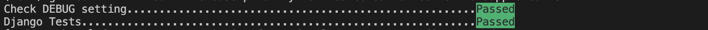

The unit tests are placed in the *tests* directory within the *recipe_book* app and were split into separate files per view/model, to maintain better readability.

In brief, the tests focus on aspects such as:
- Ensuring duplicate entries cannot be created where there should be a uniqueness constraint (e.g. the same user should not be able to favourite a recipe twice, or there should not be two recipes with the same title).
- Ensuring an anonymous user cannot access functionality that should be restricted to logged-in users (e.g. posting a comment).
- Ensuring recipes, ratings and favourites *are* created/updated/deleted when requests are valid (e.g. user is authenticated, and values are of valid format).
- Ensuring that methods in general return expected values and status codes.

In total 54 tests were written:

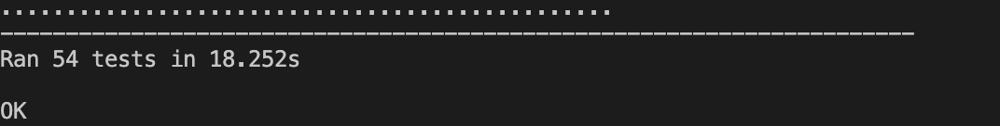

### Jest tests for JavaScript

Click for details relating to Jest tests

Due mainly to time constraints, Jest tests were not prioritised throughout the development of the project. However, a few tests were added at the end of the development phase, focusing on testing the most crucial aspects of the JavaScript code. Specifically, the tests aim to test the JavaScript functions responsible for making POST, PUT, and DELETE requests to the backend.

The tests mock the required dependencies, call these functions and check that the fetch was made with the expected arguments, as well as that the response is as expected.

In total 12 tests were written, in 8 test suites.

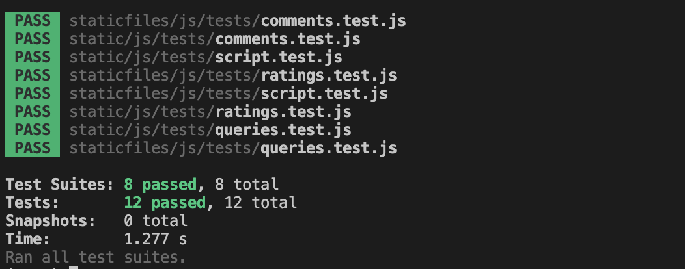

These tests can be found in the *static*/*js*/*tests* directory. The tests are split into separate files, corresponding to the JavaScript file with the same name. E.g. tests relating to *comments.js* are in the file *comments.test.js*.

## Lighthouse tests

The website's different pages were tested using Lighthouse, to ensure performance and accessibility.

Click to see screenshots of test results on mobile

- Home page
    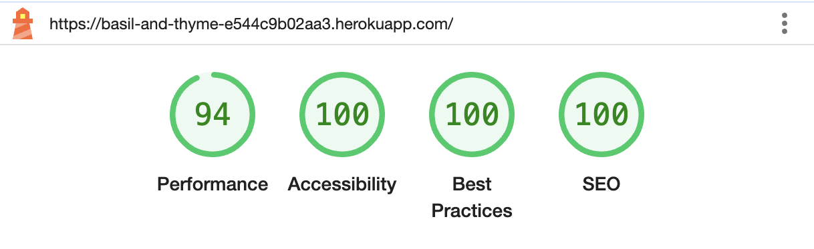

- Recipes page
    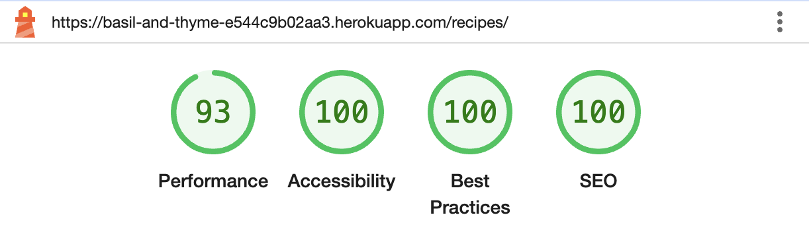

- Recipe detail page (example)
    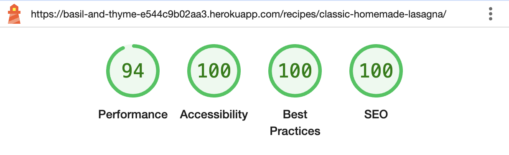

- Favourites page
    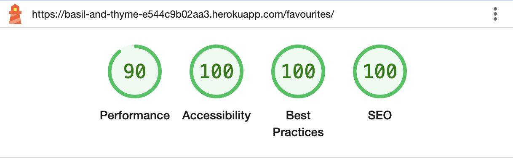

- Sign up page
    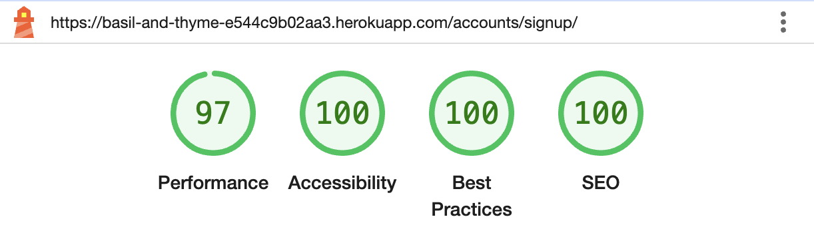

- Sign out page
    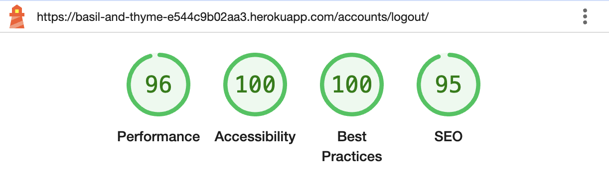

- Sign in page
    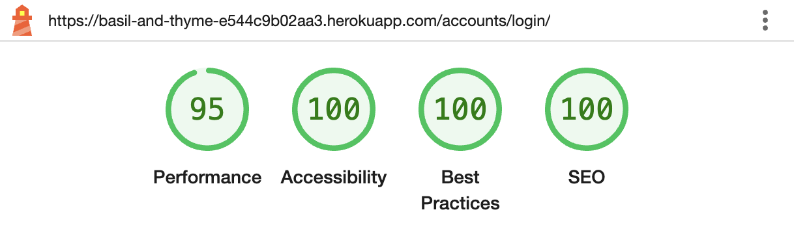

Click to see screenshots of test results on desktop

- Home page
    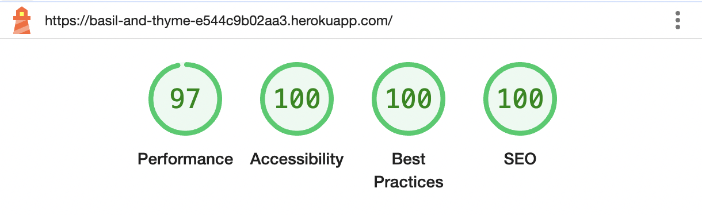

- Recipes page
    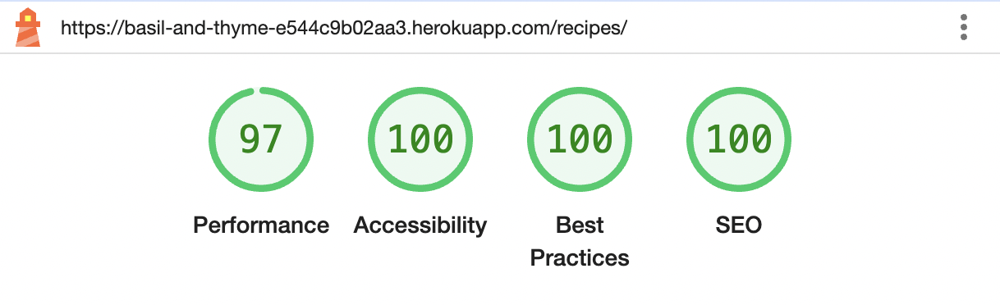

- Recipe detail page (example)
    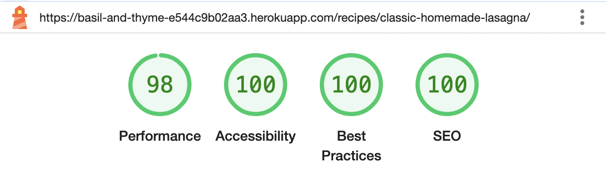

- Favourites page
    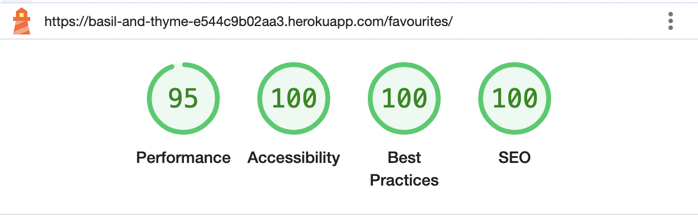

- Sign up page
    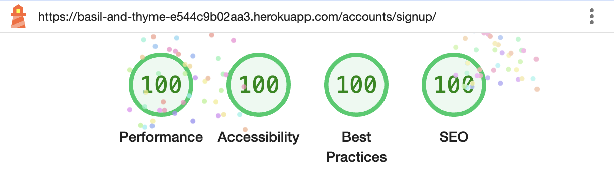

- Sign out page
    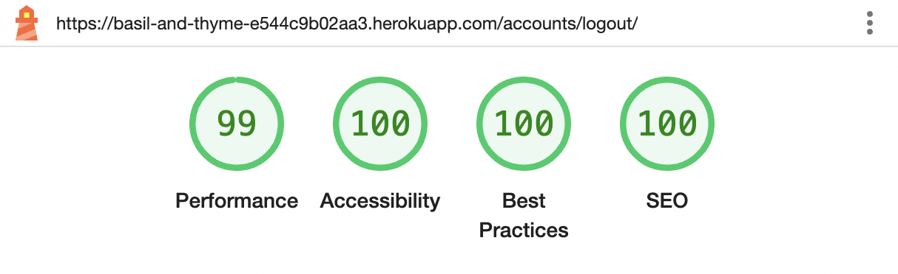

- Sign in page
    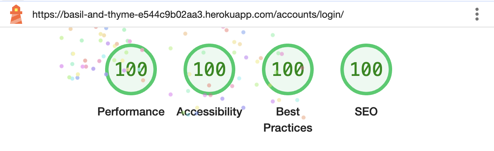

### Performance optimisation
I initially had a lower performance score, mainly due to LCP (Largest Contentful Paint) and FCP (First Contentful Paint). These issues appeared when testing the deployed version of the website, while scores were high when testing in the local environment.

I implemented the following optimisations to improve the score, including:
- Lazy loading of images that would not appear above the fold
- Deferring non-critical resources
- Using Cloudinary for all of my images (previously I had only used Cloudinary to store the images belonging to the recipes).

After taking these actions, the highest impact suggestion raised by the Lighthouse report was to preload my LCP image.

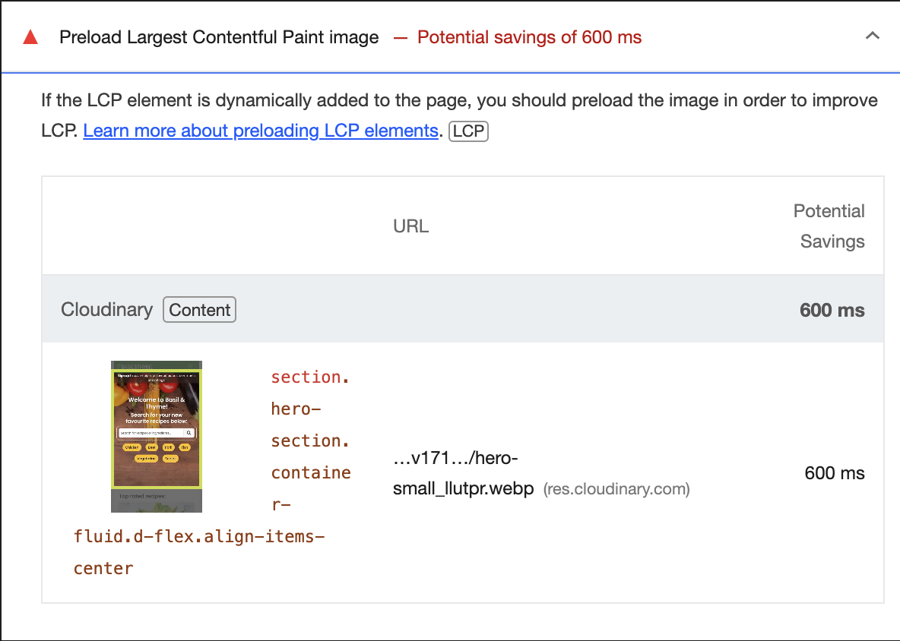

Testing this resulted in a significantly higher score. However, I would sometimes get a warning in the console, about preloading a resource and then not using it within the first few seconds.

Reading up on this warning, I came to the understanding it might be appearing in situations when the browser has cached the image, in which case the preload is unnecessary.

Given that the score was significantly higher with the preload, and the warning seemingly explained by the possibility of the image being cached, I decided to keep preloading the image.

## Validation of HTML

All pages were validated using W3C's Markup Validation Service, with no errors or warnings.

Click for screenshots of validation results per page

- Home page (index.html)
    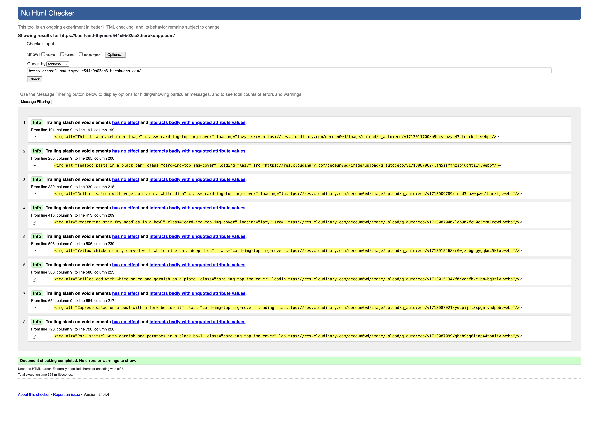

- Recipes page (with results)
    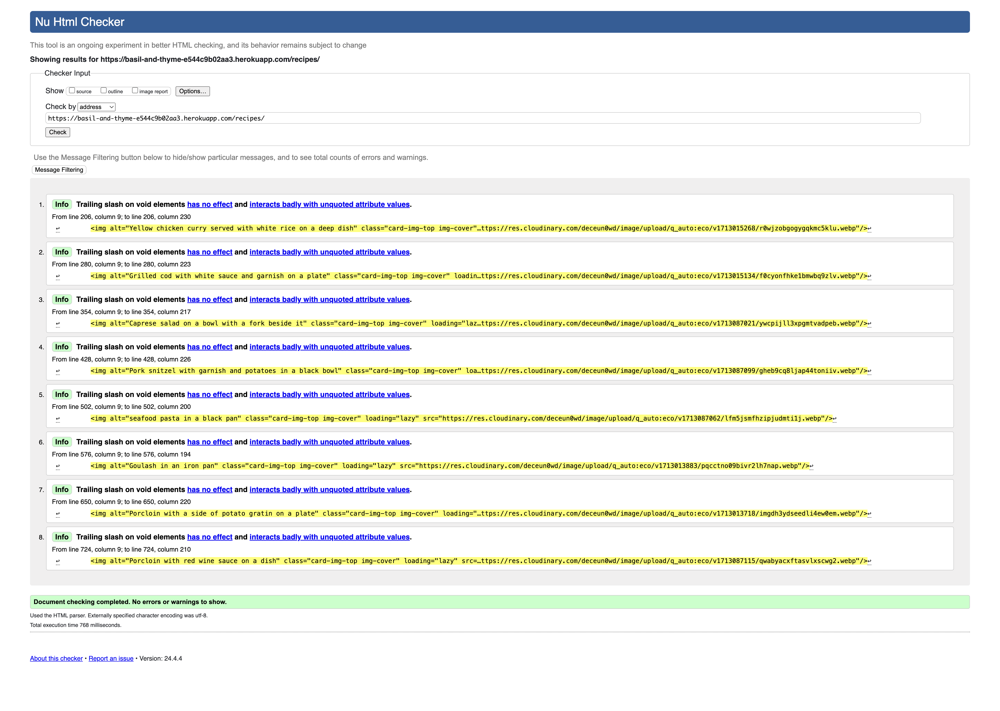

- Recipes page (with no results)
    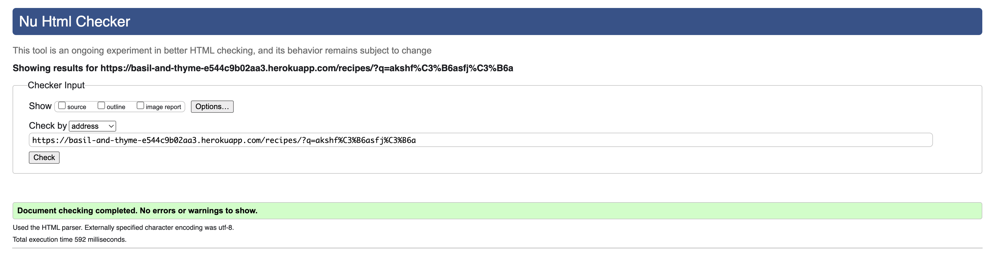

- Favourites page (while not logged in)
    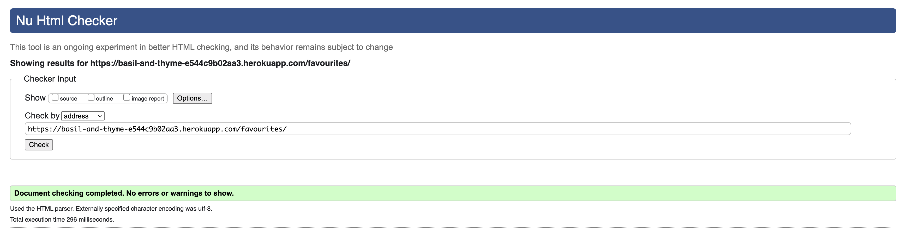

- Recipe page - Chicken yellow curry
    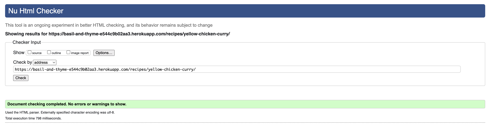

- Recipe page - Seafood pasta
    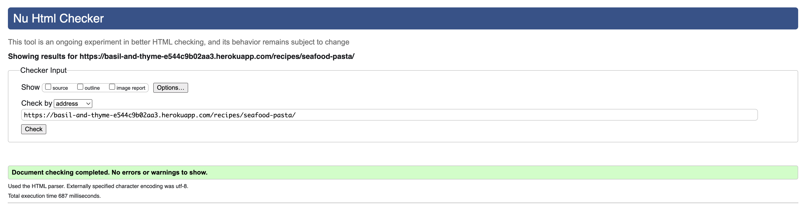

- Sign-up page
    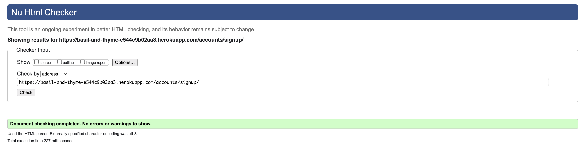

- Sign-in page
    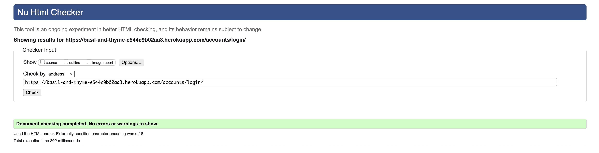

In addition to the above, the following were validated by copying the entirety of the page source code, and validating by direct input:
- The log-out page (/account/logout/)
- The favourites page while logged in, with no recipes favourited
- The favourites page while logged in, with recipes favourited
- A recipe detail page, while logged in, with comments posted
- The 404 and 500 pages

*Note*
All HTML code validated with no error or warnings. On pages that contain recipe cards, the tool did raise an "Info"-type message. The recipe cards utilize a Cloudinary tag to insert the images. This allows for using Cloudinary features such as automatically optimizing image quality. However, it seems the *img* tags that get inserted as a result contain a trailing "/". Since this cannot be easily changed, without losing the optimisation feature, and since the messages are of the type "info" rather than "warning", I will not take action to change this.

## Validation of CSS

CSS was validated using [W3C's CSS Validation Service](https://jigsaw.w3.org/css-validator/validator).

Click to see CSS validation details

### Validating *style.css*

Validating the custom CSS by uploading the file *style.css* results in no errors.

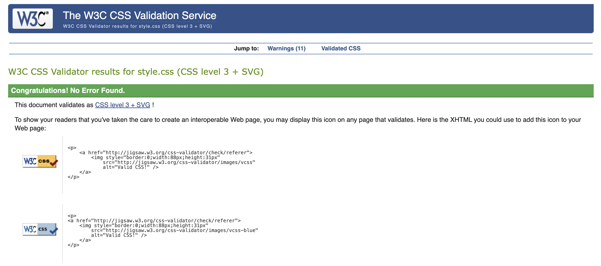

The tool raises 11 warnings:
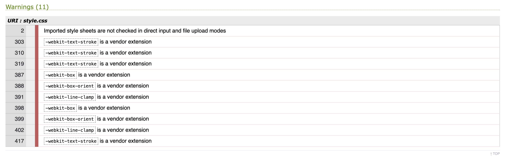

The first warning just implies the tool does not access my Bootstrap CSS, as expected.

The remaining warnings relate to the use of vendor extensions. 
I am aware these may not be supported across all browsers. However, their application is not crucial to using the website. These vendor extensions are used for two purposes in the CSS file:
1. To truncate the title and teaser text in recipe cards. Without the truncation, the overflow is instead hidden. 
2. To increase the visibility of the heart buttons on the recipe cards. Given that these buttons are overlaid on top of an image, it was difficult to find a style that would stand out well on a multitude of backgrounds. If the *text-stroke* is not applied, the style is a simple white, which may be hard to see depending on the background image. However, the user can in this case reach the same functionality (favouriting the recipe) from the individual recipe's detail page.

### A note on validating the website by URL

When validating the website by URL, the tool raises errors, as well as a multitude of warnings. However, all errors and all errors except the ones mentioned above relate to Bootstrap.

Visiting Bootstrap's website, I found the following text, providing an explanation for these errors and warnings.

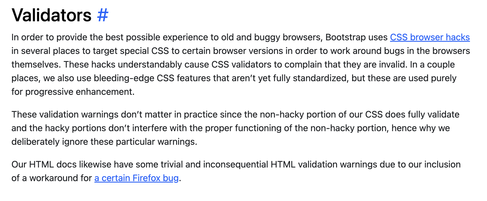

## Linting of Python code

All Python code was linted using Code Institute's [CI Python Linter](https://pep8ci.herokuapp.com/) with no errors or warnings.

Screenshots of the results per file can be found in this [pdf](documentation/linting-results.pdf).

## Linting of JavaScript code

All JS code was linted using [JSHint](https://jshint.com/) to ensure code validity.

Given that several JS files were used in the project, both Bootstrap and custom JS files, the files all contained undefined/unused variables. For example, there is a function `openModal()` in *script.js*, which is never called within *script.js*, but is called in most of the other JS files. So *openModal* was showing as an *unused variable* in *script.js* and an *undefined variable* in the other files.

After making sure that all undefined variables and unused variables were of this type, or a global type (e.g. *module*), I changed the JSHint configuration to not display warnings of this type before proceeding.

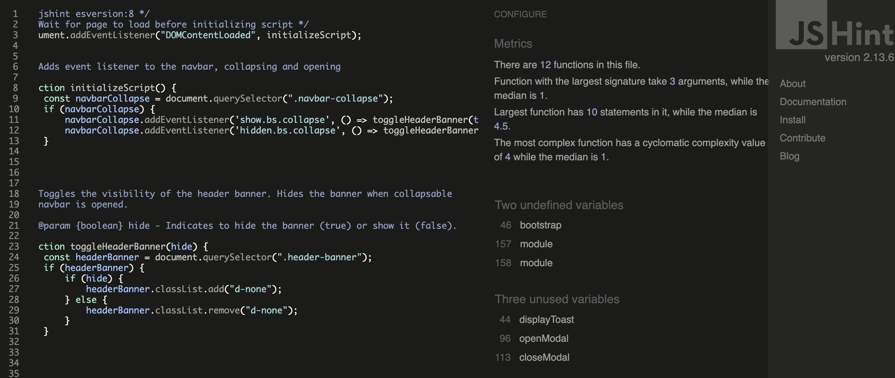
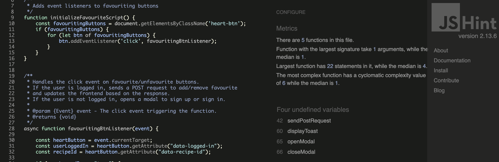

Click to see screenshots of linting results per file

- script.js
    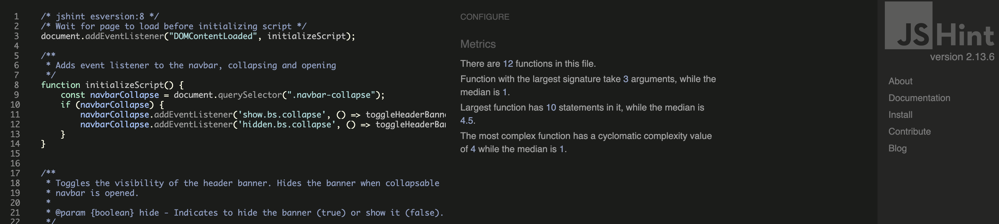

- favourites.js
    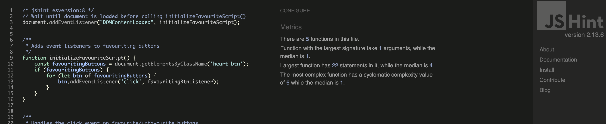

- comments.js
    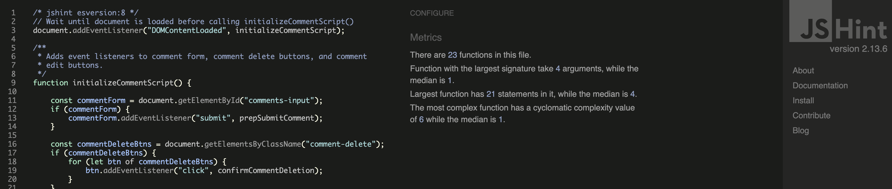

- queries.js
    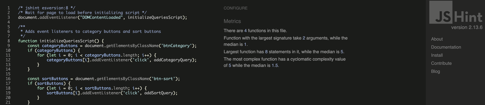

- ratings.js
    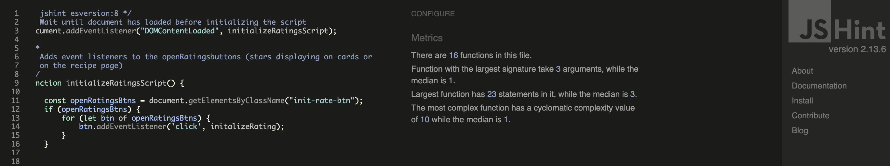

- script.test.js
    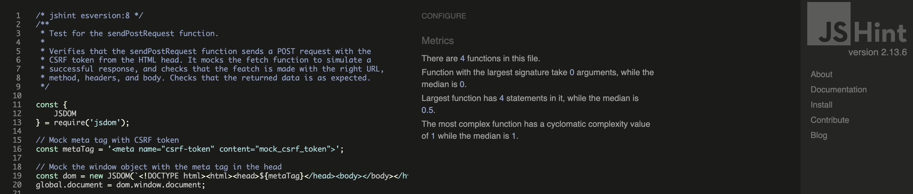

- ratings.test.js
    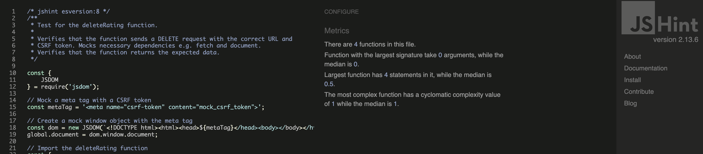

- queries.test.js
    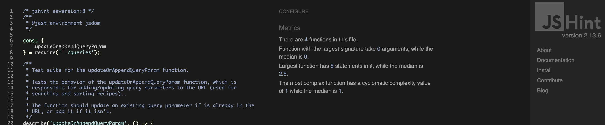

- comments.test.js
    

