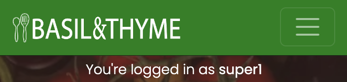
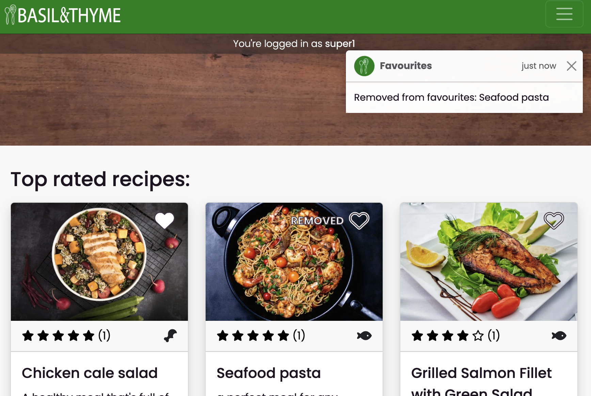

# Testing

**Table of content**
- [Browser compatibility testing](#browser-compatibility)
- [Responsiveness testing](#responsiveness)
- [Manual testing](#manual-testing)
    - [Manual testing of core functionality](#manual-test-functionality)
    - [Manual testing of user stories](#user-story-testing)
- [Automated tests](#automated-tests)
    - [Django unit tests](#unittests)
    - [Jest tests for JavaScript](#jest-tests)
- [Lighthouse tests](#lighthouse)
- [Validation of HTML](#html-validation)
- [Validation of CSS](#css-validation)
- [Linting of Python code](#python-lint)
- [Linting of JavaScript code](#js-lint)

## Browser compatibility testing

To ensure cross-browser compatibility, the website was reviewed on Chrome, Safari, Microsoft Edge and Firefox.

Click on the links below to see screenshots of the website opened on different browsers:

Chrome

Safari

Microsoft Edge

Firefox

## Responsiveness testing

The website was reviewed with [Responsive Viewer](https://chromewebstore.google.com/detail/responsive-viewer/inmopeiepgfljkpkidclfgbgbmfcennb), to test responsiveness and ensure a good and consistent user experience across device types.

The review was documented in the PDFs below, split per reviewed page:
- [Home page](documentation/responsiveness/responsive-home.pdf)
- [Recipes page](documentation/responsiveness/responsive-recipes.pdf)
- [Recipe detail page](documentation/responsiveness/responsive-recipe-page.pdf)
- [Favourites page](documentation/responsiveness/responsive-favourites.pdf)
- [Sign up page](documentation/responsiveness/responsive-signup.pdf)
- [Sign in page](documentation/responsiveness/responsive-signin.pdf)
- [Sign out page](documentation/responsiveness/responsive-signout.pdf)

## Manual testing TBC

### Manual testing of core functionality TBC

### Manual testing of user stories WIP

#### Epic: *Navigation and structure*

Click for manual tests of user stories relating to Navigation and structure

| __User story__ | __Acceptance criteria__ | __Pass?__ | __Screenshot (if relevant)__ | __Comments__ |
| ------------- | -----------| -------------------- | :-------: | ------------ |
| As a **Site User**, I can always see the main navigation options on the top of the page so that I can easily and intuitively find my way around the website. | 1. Given a user is not logged in, at the top of the page, the user can see the options of “home”, “register”, “log in”, and “favourites”.   2. Given the user is logged in, the options showing are instead “home”, “log out”, and “favourites”.   3. These options are visible and reachable from all pages on the website.   4. The options have a hover effect to provide instant feedback to the user when navigating the site. | Y |        | Main navigation is global.    The page "Recipes" was part of the initial plan for the site, but was accidentially left out from the user story  |
| As a **Site User** I can see an **informative 404 page guiding me back to the main page** if I visit a page that does not exist by mistake so that I can easily get back to the home page with minimal disruption. | 1. Given a user visits a page on the website that does not exist, they are served a custom 404 page.   2. The 404 page contains a link back to the home page. | Y |  | - |
| As a **Site User** I can see the website's favicon so that I can easily find the website if I have multiple tabs open. | 1. The site has a favicon, adhering to the website design and colour scheme | Y |  | - |

#### Epic: *Account/Login*

Click for manual tests of user stories relating to Account/Login

| __User story__ | __Acceptance criteria__ | __Pass?__ | __Screenshot (if relevant)__ | __Comments__ |
| ------------- | -----------| -------------------- | :-------: | ------------ |
| As a **Site User** I can register an account with **email and password** so that I can **comment on, rate, and save recipes.** *Edit: email not mandatory* | 1. Given an email, a user can register an account. *Edit: email not mandatory* | Y |  | Can sign up with username and password |
| As a **Site User** I can see **clear instructions, get feedback, and confirmation when trying to register an account with email** so that I can sign up without unnecessary problems and enjoy the experience. | 1. The sign-up page form includes clear instructions.   2. Given the user submits the sign-up form, the user is given confirmation on whether the sign-up was successful. | Y |         | The sign-up form contains instructions and feedback.    After sign-up/sign-in the user is redirected to the home page. The banner reflects the user is now signed in. |
| As a **Site User** with an account I can **log in** so that I can **comment on, rate, and save recipes.** | 1. Given a registered email a user can log in. *Edit: email not manadatory* | Y |  | - |
| As a **Logged-in User** I can log out so that I can feel safe in that others cannot access my credentials. | 1. Given a user is logged in, the user can click on “Log out” to log out.   2. Then the logged-out status is reflected to the user on the page | Y |     | User can log out on Sign out page.   User is redirected to the home page, where the banner reflects logged out status |

#### Epic: *View recipes*

Click for manual tests of user stories relating to View recipes

| __User story__ | __Acceptance criteria__ | __Pass?__ | __Screenshot (if relevant)__ | __Comments__ |
| ------------- | -----------| -------------------- | :-------: | ------------ |
| As a **Site User** I can see the highest rated and latest added recipes featured on the main page so that I can get inspired and get an engaging introduction to the site. | 1. When a user opens the main page, sections displaying the highest rated recipes and latest added recipes are showing.  2. Then the user can click on “See more” to see a list of all recipes sorted by rating and publication date respectively. | Y |  | *Note* Clicking "See all" will open recipes page with all recipes. However, the user will need to use the sort button to sort by highest rating |
| As a **Site User** I can search or click on a category so that I can find recipes matching my criteria. | 1. When a user opens the main page, a search bar, as well as pre selected categories/featured categories show.   2. When a user either searches or clicks on a category a list of recipes is seen, matching the user's criteria. | Y |     | Search results open on Recipes page |
| As a **Site User** I can see a paginated list of recipes so that I can select which recipe I want to view. | 1. Given more than one recipe in the database matching the users criteria, these multiple recipes are listed.  2. When a user searches or clicks on a category a list of recipes is seen.  3. Given the number of recipes in the list is larger than 8, the list is paginated. | Y |        | By default the *Recipes* page displays all recipes.    The displayed recipes correspond to the user's search query.    Pagination is present when results are more than 8 |
| As a **Site User** I can sort the recipes in a list view so that I can more easily find the recipes I am looking for. | 1. When on a list view the user can sort the list based on rating and publication date. | Y |  | - |
| As a **Site User** I can click on a recipe card so that I can read the recipe | 1. When a recipe title is clicked the detailed view of the recipe is seen. | Y |     | Clicking on a recipe card title, e.g. "Seafood pasta" opens the corresponding recipe page |

#### Epic: *Commenting*

Click for manual tests of user stories relating to Commenting

| __User story__ | __Acceptance criteria__ | __Pass?__ | __Screenshot (if relevant)__ | __Comments__ |
| ------------- | -----------| -------------------- | :-------: | ------------ |
| As a **Logged in User** I can write comments on recipes so that I can provide feedback and share my experience with other users. | 1. Given a user is logged in, they can leave a comment on the recipe detail page.   2. Then, the user is notified the comment is posted.  3. Then, the comment is visible for all users.| Y |        | The comment form displays for a logged in user.   When the user successfully submits a comment, a toast message is displayed.   The comment is published at the top of the comments list. |
| As a **Logged in User** I can **modify or delete** my comment on a recipe so that I can be in control over my contribution to the conversation.| 1. Given a logged in user, they can modify their own comment   2. Given a logged in user, they can delete their own comment   3. Then the user is notified of successful modification/deletion | Y |                | Edit and delete buttons show for comment author.    Clicking the edit button, the form will update for editing the comment.   Upon editing the comment, a toast message is displayed, and the comment is updated. A paragraph is added to confirm to user.    Clicking the delete button, the user is asked to confirm. When confirmed, a toast message is displayed. The comment is switched out to a paragraph confirming deletion. |
| As a **Site Admin** I can **disapprove comments** so that I can hide controversial comments. | 1. Given a logged in admin user, they can disapprove a comment   2. Then, the comment is no longer showing for users except for the comment author, for whom the comment is faded out   3. Then the admin user can choose to reverse the disapproval if they choose to. | Y |    | Superusers can approve and disapprove comments in the Django Admin Panel.    Disapproved comments show when the user is the comment author.   Disapproved comments are not visible for other users. |

#### Epic: *Favourites*

Click for manual tests of user stories relating to Favourites

### Epic: Favourites
| __User story__ | __Acceptance criteria__ | __Pass?__ | __Screenshot (if relevant)__ | __Comments__ |
| ------------- | -----------| -------------------- | :-------: | ------------ |
| As a **Logged in User** I can **favourite and unfavourite recipes** so that I can save or remove recipes from my favourites easily. | 1. Given a logged in user, they can click the heart button on a recipe card or the recipe details page to save a recipe to their favourites.  2. Given a logged in user, they can click the heart button of a previously favourited recipe to unsave it from their favourites.| Y |       | - |
| As a **Logged in User** I can see my favourite recipes on the favourites page so that I can **easily access my favourite recipes** when I need them. |  1. When visiting the favourites page as a logged-in user, the user can view their saved recipes.  2. If the user has not saved any recipes, they instead see an informative message explaining the "Favourites" functionality.  3. If a user who is not logged in visits the favourites page, they are informed of the functionality and prompted to sign up or log in to use it. | Y |        | - |
| As a **Logged in User** I can see the status of favouriting (favourited or not) for all recipe cards and detail pages so that I can know which recipes I have favourited without visiting the favourites page.| 1. Given a logged in user, the heart button on recipe cards and recipe detail pages are visually distinct to indicate whether the recipe is already saved.  2. Given a non-logged-in user, the heart button on all recipe cards and recipe detail pages indicate the recipe is not saved. | Y |  | Hearts are filled in when recipe is favourited, and otherwise not filled in. |
| As a **Non-Logged in User**, I can get informed to sign up or log in when trying to favourite a recipe so that I can **understand how to access the functionality.** | 1. Given a non-logged-in user, they can see the heart for favouriting recipes on the recipe cards and detail pages, so that they can be aware of the functionality.  2. Then, if a non-logged-in user tries to favourite a recipe by clicking on the heart, they are prompted to sign up or log in. | Y |  | Clicking a heart while not signed in triggers the modal. |

#### Epic: *Rating*

Click for manual tests of user stories relating to Rating

| __User story__ | __Acceptance criteria__ | __Pass?__ | __Screenshot (if relevant)__ | __Comments__ |
| ------------- | -----------| -------------------- | :-------: | ------------ |
| As a **Site User** I can see the average rating a recipe has received so that I can get an understanding of the recipe's quality. | 1. For each recipe, in the recipe details view and the card view, the recipe's average rating is displayed. | Y |    | The recipe's average rating is displayed visually by the stars. The number next to the stars is the number of the ratings the recipe has received. |
| As a **Logged in User** I can rate a recipe so that I can provide feedback on recipes in a low effort way. | 1. Given a user is logged in, they can click on one of five stars on any recipe detail page in order to give a rating of 1-5.   2. Then, the user is notified of the rating they have given.  3. Clicking on a rating a second time removes the rating.  4. Then the user is notified the rating has been removed. | Y |      | Pass, with slight edit: Instead of adding/removing ratings when clicking one of the stars on the card/recipe page, a modal was added as a middle step, to make the ratings process more clear for the user.   The ratings display will show if the user has previously rated the recipe. In this case, the user has the additional option to delete the rating. Submitting a new rating will overwrite the existing one.    A toast message is displayed to confirm addition/update/removal of a rating. |

#### Epic: *Publishing recipes*

Click for manual tests of user stories relating to Publishing recipes

| __User story__ | __Acceptance criteria__ | __Pass?__ | __Screenshot (if relevant)__ | __Comments__ |
| ------------- | -----------| -------------------- | :-------: | ------------ |
| As a **Site Admin** I can **create** draft recipes so that I can finish writing the content later. | 1. Given a logged in admin user, they can save a draft recipe  2. Then they can finish the content at a later time | Y |   | Superusers can save recipes as drafts in the Django Admin Panel. When saved as drafts the recipes are not included on the website. |
| As a **Site Admin** I can **create, read, update and delete** recipes so that I can manage my site content | 1. Given a logged in admin user, they can create a recipe   2. Given a logged in admin user, they can edit a recipe   3. Given a logged in admin user, they can update a recipe   4. Given a logged in admin user, they can delete a recipe | Y | - | Superusers can create, edit and delete recipes in the Django Admin Panel. |
| As a **Super user** I can rely on the field validation, as well as see clear instructions in the admin view so that I can trust in that the content I am publishing will be valid.| 1. All model fields have appropriate attributes   2. The admin view provides explicit and helpful instructions where necessary | Partial |      | Efforts were made to include appropriate field validation for all fields in the models.  Actions were taken to make the admin panel more user friendly for creating recipes. Fields were dividied into fieldsets, and instructions were added to some fields and fieldsets. |

#### Epic: *Accessibility*

Click for manual tests of user stories relating to Accessibility

| __User story__ | __Acceptance criteria__ | __Pass?__ | __Screenshot (if relevant)__ | __Comments__ |
| ------------- | -----------| -------------------- | :-------: | ------------ |
| As a **Site User** utilizing a screen reader I can listen to descriptive text representing any visual element on the website so that I can be included, navigate on the website, access the content, and use all core functionality. | 1. All images have an alt-text.   2. All links have either a descriptive link text or an ARIA-label   3. All buttons consisting of icons have an ARIA-label and the icon is hidden for screen readers.   4.  All information communicated by a visual element on the site have a text alternative, so that screen reader users can take part of the information.   5. Semantic HTML elements have been used where suitable, in order to further enable screen reader users to consume the website content. | Y | - | - | 
| As a Site User not able to utilise a mouse I can **focus on and access all interactive elements on the website using a keyboard** so that I can be included, navigate on the website, access the content, and use all core functionality. | 1. All interactive elements, such as buttons, form fields, and navigation, are accessible using a keyboard alone, without relying on mouse interactions. | Y | - | Tested the following actions without using a mouse: open an account, search for recipes, add a recipe to favourites, leave a rating, leave a comment, delete a comment. | 

#### *Miscellaneous*: User stories not belonging to a specific epic

Click for manual tests of miscellanous user stories

| __User story__ | __Acceptance criteria__ | __Pass?__ | __Screenshot (if relevant)__ | __Comments__ |
| ------------- | -----------| -------------------- | :-------: | ------------ |
| As a **Site User** finding the website through a search engine I can read a descriptive search result so that I can understand if the result is relevant to me. | 1. All pages have a meta description and keywords   2. All pages have a title | Y | - | All pages have a title. All pages that should be searchable have a meta description and keywords (e.g. the 404 page does not have meta keywords). |
|  As a **Site User** I can observe consistent styling, structure and interaction design across all pages on the website so that I can have a pleasant experience with the website. | 1. The website adhers to the colour scheme, font choices and other design choices outlined in the README.   2. All interactive elements provide a reaction when interacted with. | Y | - | Efforts were made to adher to the style guidelines set at the beginning of the project, in terms of colours and fonts. In general efforts were made to use styles relatively consistently across pages.  All interactive elements provide some form of instant visual feedback. |

## Automated tests

Due to time constraints, as well as limited experience with automated testing, not all scenarios are covered by these tests. The intention was rather that the automated tests may complement the manual testing of the project, and provide more robust testing as a whole.

### Django unit tests

 

Click for details relating to Django unit tests

Unit tests were written to test the core functionality in all models and views of the project. These tests were written throughout the development of the project and were run as part of *pre-commit*, helping to continuously ensure code was working as intended, by stopping any commit that would lead to a failure of an existing test.

The unit tests are placed in the *tests* directory within the *recipe_book* app and were split into separate files per view/model, to maintain better readability.

In brief, the tests focus on aspects such as:
- Ensuring duplicate entries cannot be created where there should be a uniqueness constraint (e.g. the same user should not be able to favourite a recipe twice, or there should not be two recipes with the same title).
- Ensuring an anonymous user cannot access functionality that should be restricted to logged-in users (e.g. posting a comment).
- Ensuring recipes, ratings and favourites *are* created/updated/deleted when requests are valid (e.g. user is authenticated, and values are of valid format).
- Ensuring that methods in general return expected values and status codes.

In total 54 tests were written:

### Jest tests for JavaScript

Click for details relating to Jest tests

Due mainly to time constraints, Jest tests were not prioritised throughout the development of the project. However, a few tests were added at the end of the development phase, focusing on testing the most crucial aspects of the JavaScript code. Specifically, the tests aim to test the JavaScript functions responsible for making POST, PUT, and DELETE requests to the backend.

The tests mock the required dependencies, call these functions and check that the fetch was made with the expected arguments, as well as that the response is as expected.

In total 12 tests were written, in 8 test suites.

These tests can be found in the *static*/*js*/*tests* directory. The tests are split into separate files, corresponding to the JavaScript file with the same name. E.g. tests relating to *comments.js* are in the file *comments.test.js*.

## Lighthouse tests

The website's different pages were tested using Lighthouse, to ensure performance and accessibility.

Click to see screenshots of test results on mobile

- Home page
    

- Recipes page
    

- Recipe detail page (example)
    

- Favourites page
    

- Sign up page
    

- Sign out page
    

- Sign in page
    

Click to see screenshots of test results on desktop

- Home page
    

- Recipes page
    

- Recipe detail page (example)
    

- Favourites page
    

- Sign up page
    

- Sign out page
    

- Sign in page
    

### Performance optimisation
I initially had a lower performance score, mainly due to LCP (Largest Contentful Paint) and FCP (First Contentful Paint). These issues appeared when testing the deployed version of the website, while scores were high when testing in the local environment.

I implemented the following optimisations to improve the score, including:
- Lazy loading of images that would not appear above the fold
- Deferring non-critical resources
- Using Cloudinary for all of my images (previously I had only used Cloudinary to store the images belonging to the recipes).

After taking these actions, the highest impact suggestion raised by the Lighthouse report was to preload my LCP image.

Testing this resulted in a significantly higher score. However, I would sometimes get a warning in the console, about preloading a resource and then not using it within the first few seconds.

Reading up on this warning, I came to the understanding it might be appearing in situations when the browser has cached the image, in which case the preload is unnecessary.

Given that the score was significantly higher with the preload, and the warning seemingly explained by the possibility of the image being cached, I decided to keep preloading the image.

## Validation of HTML

All pages were validated using W3C's Markup Validation Service, with no errors or warnings.

Click for screenshots of validation results per page

- Home page (index.html)
    

- Recipes page (with results)
    

- Recipes page (with no results)
    

- Favourites page (while not logged in)
    

- Recipe page - Chicken yellow curry
    

- Recipe page - Seafood pasta
    

- Sign-up page
    

- Sign-in page
    

In addition to the above, the following were validated by copying the entirety of the page source code, and validating by direct input:
- The log-out page (/account/logout/)
- The favourites page while logged in, with no recipes favourited
- The favourites page while logged in, with recipes favourited
- A recipe detail page, while logged in, with comments posted
- The 404 and 500 pages

*Note*
All HTML code validated with no error or warnings. On pages that contain recipe cards, the tool did raise an "Info"-type message. The recipe cards utilize a Cloudinary tag to insert the images. This allows for using Cloudinary features such as automatically optimizing image quality. However, it seems the *img* tags that get inserted as a result contain a trailing "/". Since this cannot be easily changed, without losing the optimisation feature, and since the messages are of the type "info" rather than "warning", I will not take action to change this.

## Validation of CSS

CSS was validated using [W3C's CSS Validation Service](https://jigsaw.w3.org/css-validator/validator).

Click to see CSS validation details

### Validating *style.css*

Validating the custom CSS by uploading the file *style.css* results in no errors.

The tool raises 11 warnings:

The first warning just implies the tool does not access my Bootstrap CSS, as expected.

The remaining warnings relate to the use of vendor extensions. 
I am aware these may not be supported across all browsers. However, their application is not crucial to using the website. These vendor extensions are used for two purposes in the CSS file:
1. To truncate the title and teaser text in recipe cards. Without the truncation, the overflow is instead hidden. 
2. To increase the visibility of the heart buttons on the recipe cards. Given that these buttons are overlaid on top of an image, it was difficult to find a style that would stand out well on a multitude of backgrounds. If the *text-stroke* is not applied, the style is a simple white, which may be hard to see depending on the background image. However, the user can in this case reach the same functionality (favouriting the recipe) from the individual recipe's detail page.

### A note on validating the website by URL

When validating the website by URL, the tool raises errors, as well as a multitude of warnings. However, all errors and all errors except the ones mentioned above relate to Bootstrap.

Visiting Bootstrap's website, I found the following text, providing an explanation for these errors and warnings.

## Linting of Python code

All Python code was linted using Code Institute's [CI Python Linter](https://pep8ci.herokuapp.com/) with no errors or warnings.

Screenshots of the results per file can be found in this [pdf](documentation/linting-results.pdf).

## Linting of JavaScript code

All JS code was linted using [JSHint](https://jshint.com/) to ensure code validity.

Given that several JS files were used in the project, both Bootstrap and custom JS files, the files all contained undefined/unused variables. For example, there is a function `openModal()` in *script.js*, which is never called within *script.js*, but is called in most of the other JS files. So *openModal* was showing as an *unused variable* in *script.js* and an *undefined variable* in the other files.

After making sure that all undefined variables and unused variables were of this type, or a global type (e.g. *module*), I changed the JSHint configuration to not display warnings of this type before proceeding.

Click to see screenshots of linting results per file

- script.js
    

- favourites.js
    

- comments.js
    

- queries.js
    

- ratings.js
    

- script.test.js
    

- ratings.test.js
    

- queries.test.js
    

- comments.test.js
    

